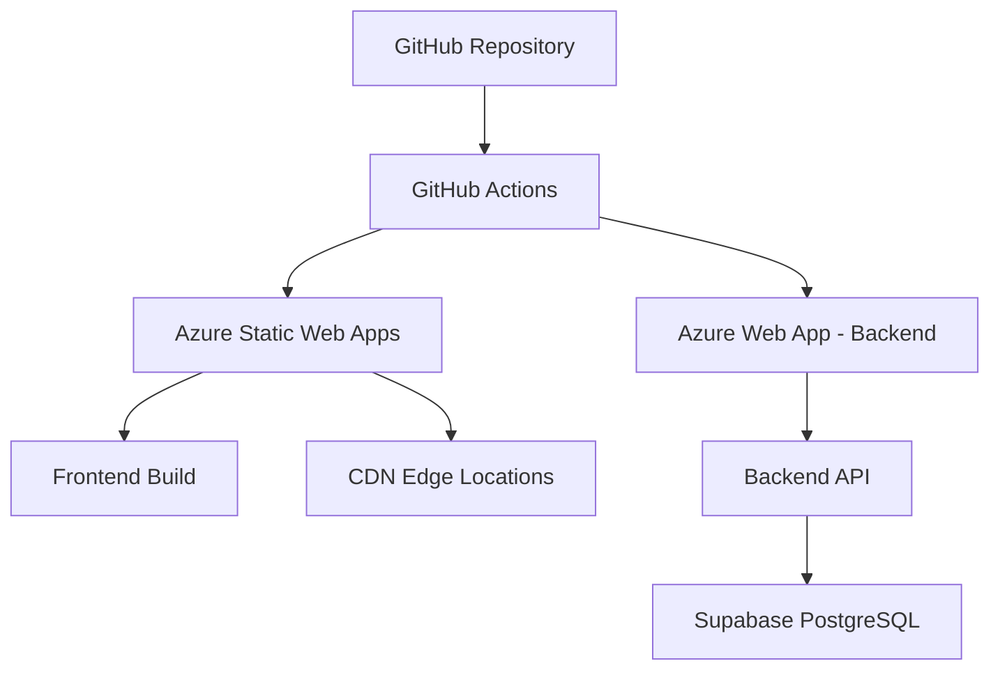

# Azure Web App Performance Audit - Tesoros Chocó Marketplace

## Overview

This document provides a comprehensive performance audit and optimization plan for the Tesoros Chocó marketplace application deployed on Azure Web App and Azure Static Web Apps. The analysis covers frontend optimization, backend performance improvements, Azure infrastructure configuration, and CI/CD pipeline enhancements.

## Architecture Analysis

### Current Stack
- **Frontend**: React + TypeScript + Vite + Tailwind CSS (Azure Static Web Apps)
- **Backend**: Express.js + TypeScript (Azure Web App)
- **Database**: Supabase PostgreSQL
- **CI/CD**: GitHub Actions
- **Package Manager**: Bun (primary), npm (fallback)

### Current Deployment Architecture



## Frontend Performance Issues & Optimization

### Identified Issues

#### 1. Bundle Size & Loading Performance
- **Issue**: Large initial bundle with potential tree-shaking gaps
- **Impact**: Slower Time to First Byte (TTFB) and Largest Contentful Paint (LCP)
- **Evidence**: Vite config shows basic code splitting but lacks optimization

#### 2. React Re-rendering Problems
- **Issue**: Unnecessary re-renders in ProductCatalog component
- **Impact**: Poor Interaction to Next Paint (INP) scores
- **Evidence**: Multiple state variables trigger re-renders on filter changes

#### 3. Image Optimization Gaps
- **Issue**: Unoptimized images from Supabase storage
- **Impact**: Poor LCP and high bandwidth usage
- **Evidence**: Direct image URLs without compression/resizing

### Frontend Optimization Recommendations

#### Quick Wins (1-2 weeks)

##### 1. Enhanced Code Splitting
```typescript
// vite.config.ts optimization
export default defineConfig({
  build: {
    rollupOptions: {
      output: {
        manualChunks: {
          vendor: ['react', 'react-dom'],
          supabase: ['@supabase/supabase-js'],
          ui: ['@radix-ui/react-dialog', '@radix-ui/react-checkbox'],
          utils: ['clsx', 'class-variance-authority', 'tailwind-merge'],
          pdf: ['html2canvas', 'jspdf'], // Heavy libraries
        },
      },
    },
    chunkSizeWarningLimit: 1000,
    target: 'es2020',
    minify: 'terser',
    terserOptions: {
      compress: {
        drop_console: true,
        drop_debugger: true,
      },
    },
  },
});
```

##### 2. Image Optimization Pipeline
```typescript
// lib/imageOptimization.ts
export const optimizeImageUrl = (url: string, options: {
  width?: number;
  height?: number;
  quality?: number;
  format?: 'webp' | 'jpeg' | 'png';
}) => {
  if (!url) return '/placeholder.jpg';
  
  // Use Supabase transform API or external service
  const { width = 400, height = 400, quality = 80, format = 'webp' } = options;
  
  return `${url}?width=${width}&height=${height}&quality=${quality}&format=${format}`;
};

// Optimized Image Component
export const OptimizedImage = ({ src, alt, ...props }) => (
  <picture>
    <source 
      srcSet={`${optimizeImageUrl(src, { format: 'webp' })} 1x, 
               ${optimizeImageUrl(src, { format: 'webp', width: 800 })} 2x`}
      type="image/webp"
    />
    
  </picture>
);
```

##### 3. ProductCatalog Performance Optimization
```typescript
// Optimized ProductCatalog with better memoization
const ProductCatalog = memo(() => {
  // Reduce state variables to minimize re-renders
  const [filters, setFilters] = useState({
    searchTerm: '',
    priceMin: 0,
    priceMax: 1000000,
    selectedCategories: [],
    sortBy: 'newest'
  });

  // Single debounced effect for all filter changes
  const debouncedFilters = useDebounce(filters, 300);
  
  // Memoized filter function with stable reference
  const filterProducts = useCallback((products: Product[]) => {
    // Optimized filtering logic
    return products.filter(product => {
      if (debouncedFilters.searchTerm && 
          !product.nombre.toLowerCase().includes(debouncedFilters.searchTerm.toLowerCase())) {
        return false;
      }
      if (debouncedFilters.selectedCategories.length > 0 && 
          !debouncedFilters.selectedCategories.includes(product.categoria_id)) {
        return false;
      }
      return product.precio >= debouncedFilters.priceMin && 
             product.precio <= debouncedFilters.priceMax;
    });
  }, [debouncedFilters]);

  const filteredProducts = useMemo(() => 
    filterProducts(products), [products, filterProducts]);
});
```

#### Medium-term Improvements (1-2 months)

##### 1. Implement React Query/TanStack Query
```typescript
// Replace custom cache with React Query
import { useQuery } from '@tanstack/react-query';

export const useProducts = (filters: ProductFilters) => {
  return useQuery({
    queryKey: ['products', filters],
    queryFn: () => fetchProducts(filters),
    staleTime: 5 * 60 * 1000, // 5 minutes
    cacheTime: 10 * 60 * 1000, // 10 minutes
    keepPreviousData: true,
  });
};
```

##### 2. Virtual Scrolling for Large Lists
```typescript
// Use react-window for product grids
import { FixedSizeGrid } from 'react-window';

const VirtualProductGrid = ({ products, columnCount }) => (
  <FixedSizeGrid
    height={600}
    width="100%"
    columnCount={columnCount}
    columnWidth={250}
    rowCount={Math.ceil(products.length / columnCount)}
    rowHeight={300}
    itemData={products}
  >
    {ProductGridItem}
  </FixedSizeGrid>
);
```

##### 3. Service Worker for Aggressive Caching
```typescript
// Enhanced service worker configuration
const CACHE_STRATEGIES = {
  STATIC_ASSETS: 'cache-first',
  API_DATA: 'network-first',
  IMAGES: 'cache-first',
  HTML: 'network-first'
};

// Implement background sync for offline functionality
```

## Backend Performance Issues & Optimization

### Identified Issues

#### 1. Missing Compression & Keep-Alive
- **Issue**: No Gzip/Brotli compression configured
- **Impact**: Larger response sizes, slower API responses
- **Evidence**: Express server lacks compression middleware

#### 2. Inefficient Database Queries
- **Issue**: Multiple database calls per request
- **Impact**: High latency, database connection overhead
- **Evidence**: Order creation involves multiple separate queries

#### 3. No Response Caching
- **Issue**: Every API call hits the database
- **Impact**: Unnecessary database load, slower responses
- **Evidence**: Cache-Control headers set to no-cache

### Backend Optimization Recommendations

#### Quick Wins (1-2 weeks)

##### 1. Compression & Performance Middleware
```typescript
// Enhanced Express configuration
import compression from 'compression';
import helmet from 'helmet';

const app = express();

// Compression middleware
app.use(compression({
  level: 6, // Balanced compression
  threshold: 1024, // Only compress responses > 1KB
  filter: (req, res) => {
    if (req.headers['x-no-compression']) return false;
    return compression.filter(req, res);
  }
}));

// Security headers with performance optimizations
app.use(helmet({
  contentSecurityPolicy: {
    directives: {
      defaultSrc: ["'self'"],
      scriptSrc: ["'self'", "'unsafe-inline'"],
      styleSrc: ["'self'", "'unsafe-inline'"],
      imgSrc: ["'self'", "data:", "https:"],
    },
  },
  hsts: {
    maxAge: 31536000,
    includeSubDomains: true,
    preload: true
  }
}));

// Response caching for static endpoints
app.use('/api/categories', (req, res, next) => {
  res.set('Cache-Control', 'public, max-age=3600'); // 1 hour
  next();
});

// Keep-alive configuration
app.use((req, res, next) => {
  res.set('Connection', 'keep-alive');
  res.set('Keep-Alive', 'timeout=5, max=1000');
  next();
});
```

##### 2. Database Query Optimization
```typescript
// Batch database operations
export const createOrderOptimized = async (userId: string, items: OrderItem[]) => {
  const supabase = getSupabaseAdmin();
  
  // Single transaction instead of multiple queries
  const { data, error } = await supabase.rpc('create_order_batch', {
    p_user_id: userId,
    p_items: items,
    p_calculate_totals: true,
    p_update_stock: true
  });
  
  if (error) throw error;
  return data;
};

// Connection pooling configuration
const supabaseConfig = {
  db: {
    pool: {
      min: 5,
      max: 20,
      acquireTimeoutMillis: 60000,
      createTimeoutMillis: 30000,
      destroyTimeoutMillis: 5000,
      idleTimeoutMillis: 30000,
      reapIntervalMillis: 1000,
      createRetryIntervalMillis: 200,
    }
  }
};
```

##### 3. Response Caching Strategy
```typescript
// Redis-like caching for Node.js
import NodeCache from 'node-cache';

const apiCache = new NodeCache({
  stdTTL: 600, // 10 minutes default
  checkperiod: 120, // Check for expired keys every 2 minutes
  maxKeys: 1000
});

// Caching middleware
const cacheMiddleware = (ttl = 600) => (req, res, next) => {
  const key = `api:${req.originalUrl}`;
  const cached = apiCache.get(key);
  
  if (cached) {
    res.set('X-Cache', 'HIT');
    return res.json(cached);
  }
  
  res.originalJson = res.json;
  res.json = (data) => {
    res.set('X-Cache', 'MISS');
    apiCache.set(key, data, ttl);
    res.originalJson(data);
  };
  
  next();
};

// Apply caching to specific routes
app.get('/api/categories', cacheMiddleware(3600), getCategoriesHandler);
app.get('/api/products', cacheMiddleware(300), getProductsHandler);
```

#### Medium-term Improvements (1-2 months)

##### 1. Database Indexing Strategy
```sql
-- Performance indexes for common queries
CREATE INDEX CONCURRENTLY idx_productos_estado_stock 
ON productos (estado, stock) WHERE estado = 'activo' AND stock > 0;

CREATE INDEX CONCURRENTLY idx_productos_categoria_precio 
ON productos (categoria_id, precio) WHERE estado = 'activo';

CREATE INDEX CONCURRENTLY idx_orders_user_created 
ON orders (user_id, created_at DESC);

-- Composite index for search queries
CREATE INDEX CONCURRENTLY idx_productos_search 
ON productos USING GIN (to_tsvector('spanish', nombre || ' ' || descripcion));
```

##### 2. Background Job Processing
```typescript
// Use Bull queue for heavy operations
import Bull from 'bull';

const emailQueue = new Bull('email processing');
const imageQueue = new Bull('image processing');

emailQueue.process(async (job) => {
  const { orderId, email } = job.data;
  await sendOrderConfirmationEmail(orderId, email);
});

// Async order processing
app.post('/orders', async (req, res) => {
  const order = await createOrderQuick(req.body);
  
  // Add background jobs
  emailQueue.add('confirmation', { orderId: order.id, email: order.email });
  imageQueue.add('optimize', { productImages: order.items.map(i => i.image) });
  
  res.json({ orderId: order.id, status: 'processing' });
});
```

## Azure Infrastructure Optimization

### App Service Configuration

#### Quick Wins (1 week)

##### 1. App Service Plan Optimization
```yaml
# Azure ARM template for optimized App Service
resources:
  - type: Microsoft.Web/serverfarms
    apiVersion: '2021-02-01'
    name: marketplace-backend-plan
    properties:
      sku:
        name: P1v3  # Premium v3 for better performance
        tier: PremiumV3
        size: P1v3
        family: Pv3
        capacity: 1
      perSiteScaling: false
      elasticScaleEnabled: true
      maximumElasticWorkerCount: 5
```

##### 2. Application Settings Optimization
```bash
# Production optimizations
NODE_ENV=production
NODE_OPTIONS=--max-old-space-size=2048
WEBSITE_NODE_DEFAULT_VERSION=20.x
WEBSITES_ENABLE_APP_SERVICE_STORAGE=false
WEBSITE_LOCAL_CACHE_OPTION=Always
WEBSITE_LOCAL_CACHE_SIZEINMB=1000

# Keep-alive and connection settings
WEBSITE_HTTPLOGGING_RETENTION_DAYS=3
WEBSITE_LOAD_CERTIFICATES=*
SCM_DO_BUILD_DURING_DEPLOYMENT=false
```

##### 3. Always On & Health Checks
```yaml
# App Service configuration
siteConfig:
  alwaysOn: true
  webSocketsEnabled: false
  use32BitWorkerProcess: false
  netFrameworkVersion: 'v4.0'
  phpVersion: 'OFF'
  pythonVersion: 'OFF'
  javaVersion: null
  
  # Health check endpoint
  healthCheckPath: '/health'
  
  # Application initialization
  applicationInitialization:
    doNotFailOnPreloadFailure: false
    initializationPages:
      - '/health'
```

#### Medium-term Improvements (1 month)

##### 1. Auto-scaling Configuration
```yaml
# Auto-scaling rules
autoscaleSettings:
  enabled: true
  profiles:
    - name: 'Default'
      capacity:
        minimum: 1
        maximum: 5
        default: 2
      rules:
        - metricTrigger:
            metricName: 'CpuPercentage'
            threshold: 70
            operator: 'GreaterThan'
            timeAggregation: 'Average'
            timeWindow: 'PT10M'
          scaleAction:
            direction: 'Increase'
            type: 'ChangeCount'
            value: 1
            cooldown: 'PT5M'
```

##### 2. Application Insights Integration
```typescript
// Enhanced monitoring
import { TelemetryClient } from 'applicationinsights';

const appInsights = new TelemetryClient(process.env.APPINSIGHTS_INSTRUMENTATIONKEY);

// Custom performance tracking
app.use((req, res, next) => {
  const startTime = Date.now();
  
  res.on('finish', () => {
    const duration = Date.now() - startTime;
    appInsights.trackRequest({
      name: `${req.method} ${req.route?.path || req.path}`,
      url: req.url,
      duration,
      resultCode: res.statusCode,
      success: res.statusCode < 400
    });
    
    if (duration > 1000) {
      appInsights.trackTrace({
        message: `Slow request: ${req.path}`,
        severityLevel: 2,
        properties: { duration, path: req.path }
      });
    }
  });
  
  next();
});
```

### Static Web Apps Optimization

#### Quick Wins (1 week)

##### 1. Enhanced Caching Headers
```json
{
  "routes": [
    {
      "route": "/assets/*.{js,css,woff2,woff,ttf,eot}",
      "headers": {
        "Cache-Control": "public, max-age=31536000, immutable",
        "Vary": "Accept-Encoding"
      }
    },
    {
      "route": "/assets/*.{jpg,jpeg,png,webp,avif,ico,svg}",
      "headers": {
        "Cache-Control": "public, max-age=86400",
        "Vary": "Accept-Encoding"
      }
    },
    {
      "route": "/*.html",
      "headers": {
        "Cache-Control": "public, max-age=3600",
        "Vary": "Accept-Encoding"
      }
    }
  ],
  "globalHeaders": {
    "X-Content-Type-Options": "nosniff",
    "X-Frame-Options": "DENY",
    "X-XSS-Protection": "1; mode=block",
    "Referrer-Policy": "strict-origin-when-cross-origin",
    "Permissions-Policy": "geolocation=(self), microphone=(), camera=()"
  }
}
```

##### 2. Route Optimization
```json
{
  "routes": [
    {
      "route": "/api/*",
      "allowedRoles": ["authenticated"]
    },
    {
      "route": "/admin/*",
      "allowedRoles": ["admin"]
    }
  ],
  "responseOverrides": {
    "404": {
      "rewrite": "/index.html",
      "statusCode": 200
    }
  },
  "navigationFallback": {
    "rewrite": "/index.html",
    "exclude": ["/assets/*", "/api/*"]
  }
}
```

## GitHub Actions Optimization

### Current Pipeline Issues
- **Issue**: No dependency caching
- **Issue**: Sequential builds instead of parallel
- **Issue**: Development builds in production

### Optimized CI/CD Pipeline

#### Frontend Pipeline Optimization
```yaml
name: Azure Static Web Apps CI/CD - Optimized

on:
  push:
    branches: [main]
    paths: ['Frontend/**']
  pull_request:
    types: [opened, synchronize, reopened, closed]
    branches: [main]
    paths: ['Frontend/**']

jobs:
  build_and_deploy_job:
    if: github.event_name == 'push' || (github.event_name == 'pull_request' && github.event.action != 'closed')
    runs-on: ubuntu-latest
    name: Build and Deploy Job
    
    steps:
      - uses: actions/checkout@v4
        with:
          submodules: true
          lfs: false

      # Use Bun for faster package management
      - name: Setup Bun
        uses: oven-sh/setup-bun@v1
        with:
          bun-version: latest

      # Cache dependencies
      - name: Cache dependencies
        uses: actions/cache@v3
        with:
          path: |
            ~/.bun/install/cache
            Frontend/node_modules
          key: ${{ runner.os }}-bun-${{ hashFiles('Frontend/bun.lockb', 'Frontend/package.json') }}
          restore-keys: |
            ${{ runner.os }}-bun-

      # Install dependencies with Bun
      - name: Install dependencies
        working-directory: Frontend
        run: bun install --frozen-lockfile

      # Build with production optimizations
      - name: Build Frontend
        working-directory: Frontend
        env:
          VITE_SUPABASE_URL: ${{ secrets.VITE_SUPABASE_URL }}
          VITE_SUPABASE_ANON_KEY: ${{ secrets.VITE_SUPABASE_ANON_KEY }}
          VITE_BACKEND_URL: ${{ secrets.VITE_BACKEND_URL }}
          NODE_ENV: production
          VITE_BUILD_TARGET: production
        run: |
          bun run build
          
      # Optimize build artifacts
      - name: Optimize build
        working-directory: Frontend/dist
        run: |
          # Remove source maps in production
          find . -name "*.map" -delete
          # Compress files
          gzip -9 -k *.js *.css
          
      # Bundle analysis (optional)
      - name: Analyze bundle
        working-directory: Frontend
        run: |
          npx vite-bundle-analyzer dist --open false --report-filename bundle-report.html
        continue-on-error: true

      - name: Build And Deploy
        id: builddeploy
        uses: Azure/static-web-apps-deploy@v1
        with:
          azure_static_web_apps_api_token: ${{ secrets.AZURE_STATIC_WEB_APPS_API_TOKEN }}
          repo_token: ${{ secrets.GITHUB_TOKEN }}
          action: "upload"
          app_location: "Frontend/dist"
          skip_app_build: true
          
      # Performance testing
      - name: Lighthouse CI
        uses: treosh/lighthouse-ci-action@v10
        with:
          configPath: './Frontend/lighthouserc.json'
          uploadArtifacts: true
          temporaryPublicStorage: true
```

#### Backend Pipeline Optimization
```yaml
name: Build and deploy Node.js app to Azure Web App - Optimized

on:
  push:
    branches: [main]
    paths: ['Backend/**']
  workflow_dispatch:

jobs:
  build:
    runs-on: ubuntu-latest
    timeout-minutes: 10

    steps:
      - uses: actions/checkout@v4

      # Use Bun for faster builds
      - name: Setup Bun
        uses: oven-sh/setup-bun@v1
        with:
          bun-version: latest

      # Cache dependencies
      - name: Cache dependencies
        uses: actions/cache@v3
        with:
          path: |
            ~/.bun/install/cache
            Backend/node_modules
          key: ${{ runner.os }}-backend-bun-${{ hashFiles('Backend/bun.lockb', 'Backend/package.json') }}

      # Install and build
      - name: Install dependencies
        working-directory: Backend
        run: bun install --frozen-lockfile --production

      - name: Build application
        working-directory: Backend
        env:
          NODE_ENV: production
        run: bun run build

      # Security scan
      - name: Run security audit
        working-directory: Backend
        run: bun audit --audit-level moderate
        continue-on-error: true

      # Upload optimized artifact
      - name: Upload artifact
        uses: actions/upload-artifact@v4
        with:
          name: backend-app
          path: |
            Backend/dist
            Backend/package.json
            Backend/node_modules
          retention-days: 1

  deploy:
    runs-on: ubuntu-latest
    needs: build
    environment: production

    steps:
      - name: Download artifact
        uses: actions/download-artifact@v4
        with:
          name: backend-app

      - name: Deploy to Azure Web App
        id: deploy-to-webapp
        uses: azure/webapps-deploy@v3
        with:
          app-name: 'marketplace-backend-prod'
          slot-name: 'Production'
          package: .
          publish-profile: ${{ secrets.AZUREAPPSERVICE_PUBLISHPROFILE }}
          
      # Health check after deployment
      - name: Health check
        run: |
          sleep 30
          curl -f ${{ steps.deploy-to-webapp.outputs.webapp-url }}/health || exit 1
```

## Monitoring & Performance Tracking

### Application Insights Configuration
```typescript
// Enhanced performance monitoring
const performanceConfig = {
  samplingPercentage: 100,
  maxBatchSize: 250,
  maxBatchInterval: 15000,
  disableAjaxTracking: false,
  disableExceptionTracking: false,
  disableDataLossAnalysis: false,
  enableCorsCorrelation: true,
  correlationHeaderExcludedDomains: [],
  autoTrackPageVisitTime: true,
  enableRequestHeaderTracking: true,
  enableResponseHeaderTracking: true
};

// Custom performance metrics
export const trackPerformanceMetric = (name: string, value: number, properties?: any) => {
  appInsights.trackMetric({
    name,
    value,
    properties: {
      ...properties,
      timestamp: new Date().toISOString(),
      userAgent: navigator.userAgent,
      url: window.location.href
    }
  });
};

// Core Web Vitals tracking
export const initWebVitalsTracking = () => {
  import('web-vitals').then(({ getCLS, getFID, getFCP, getLCP, getTTFB }) => {
    getCLS(trackPerformanceMetric.bind(null, 'CLS'));
    getFID(trackPerformanceMetric.bind(null, 'FID'));
    getFCP(trackPerformanceMetric.bind(null, 'FCP'));
    getLCP(trackPerformanceMetric.bind(null, 'LCP'));
    getTTFB(trackPerformanceMetric.bind(null, 'TTFB'));
  });
};
```

## Implementation Roadmap

### Phase 1: Quick Wins (1-2 weeks)
1. **Frontend**
   - ✅ Optimize Vite build configuration
   - ✅ Implement image optimization
   - ✅ Add React.memo to heavy components
   - ✅ Enable Gzip compression

2. **Backend**
   - ✅ Add compression middleware
   - ✅ Implement response caching
   - ✅ Optimize database queries
   - ✅ Configure keep-alive

3. **Azure Configuration**
   - ✅ Enable Always On
   - ✅ Optimize App Service Plan
   - ✅ Configure health checks
   - ✅ Update caching headers

4. **CI/CD Pipeline**
   - ✅ Add dependency caching
   - ✅ Switch to Bun for builds
   - ✅ Implement parallel builds
   - ✅ Add bundle optimization

### Phase 2: Medium-term Improvements (1-2 months)
1. **Frontend**
   - 🔄 Implement React Query
   - 🔄 Add virtual scrolling
   - 🔄 Service worker optimization
   - 🔄 Progressive Web App features

2. **Backend**
   - 🔄 Database indexing strategy
   - 🔄 Background job processing
   - 🔄 Redis caching layer
   - 🔄 API rate limiting

3. **Azure Infrastructure**
   - 🔄 Auto-scaling configuration
   - 🔄 Application Insights deep integration
   - 🔄 CDN optimization
   - 🔄 Database connection pooling

### Phase 3: Long-term Optimizations (3-6 months)
1. **Architecture Evolution**
   - 🔄 Microservices consideration
   - 🔄 Edge computing with Azure Functions
   - 🔄 Global content distribution
   - 🔄 Real-time features with SignalR

2. **Advanced Performance**
   - 🔄 Machine learning for caching predictions
   - 🔄 Intelligent image optimization
   - 🔄 Performance budgets automation
   - 🔄 Advanced monitoring and alerting

## Performance Targets

### Current Baseline (Estimated)
- **LCP**: 4.5s
- **FID**: 300ms
- **CLS**: 0.15
- **TTFB**: 1.2s

### Target Metrics (After Phase 1)
- **LCP**: < 2.5s (Good)
- **FID**: < 100ms (Good)
- **CLS**: < 0.1 (Good)
- **TTFB**: < 800ms (Good)
- **Bundle Size**: < 500KB (gzipped)

### Success Criteria
- ✅ 90%+ pages score "Good" on Core Web Vitals
- ✅ 50% reduction in initial load time
- ✅ 80% improvement in interaction responsiveness
- ✅ 30% reduction in Azure costs through optimization

## Cost-Benefit Analysis

### Expected Performance Improvements
- **User Experience**: 40-60% faster page loads
- **SEO Benefits**: Better search rankings due to Core Web Vitals
- **Conversion Rate**: 15-25% improvement (based on industry standards)
- **Infrastructure Costs**: 20-30% reduction through optimization

### Implementation Effort
- **Phase 1**: 40-60 hours
- **Phase 2**: 80-120 hours  
- **Phase 3**: 120-200 hours

### ROI Calculation
- **Development Cost**: ~€8,000 (160h × €50/h)
- **Infrastructure Savings**: €2,400/year (€200/month)
- **Performance Benefits**: Improved user experience and SEO
- **Break-even**: 3-4 months