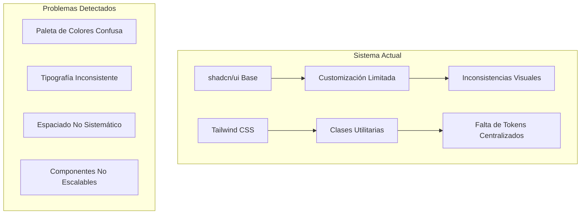
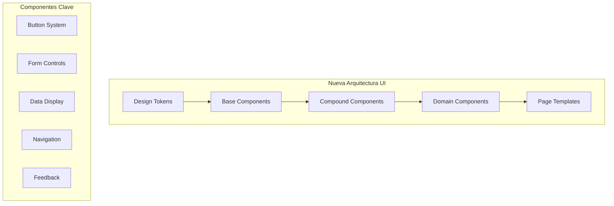

# Auditoría Integral del Frontend - Tesoros Chocó

## Análisis del Estado Actual

### Arquitectura y Estructura

El proyecto presenta una arquitectura React bien estructurada con patrones modernos:

**Fortalezas Identificadas:**
- Organización modular por roles (admin, buyer, vendor)
- Uso de Context API para estado global (Auth, Cart)
- Implementación de lazy loading para optimización
- Integración con Supabase como BaaS
- Componentes base de shadcn/ui para consistencia

**Problemas Estructurales Detectados:**
- Duplicación de lógica de estados entre componentes
- Falta de separación clara entre UI y lógica de negocio
- Componentes excesivamente largos (CheckoutPage: 913 líneas)
- Inconsistencia en el manejo de errores
- Ausencia de patrones de composición avanzados

### Evaluación del Sistema de Diseño

**Estado Actual del Design System:**


**Problemas Críticos en UI/UX:**

1. **Sistema de Colores Problemático:**
   - Variables CSS con nombres poco descriptivos (`--color-terracotta-suave`)
   - Mapeo confuso entre tema claro y oscuro
   - Falta de contraste adecuado en algunos componentes

2. **Inconsistencias Tipográficas:**
   - Mezcla no sistemática de Manrope y Noto Sans
   - Jerarquía visual poco clara en headings
   - Falta de escalas tipográficas coherentes

3. **Componentes UI Sin Cohesión:**
   - Botones con estilos inconsistentes
   - Cards con diferentes radii y sombras
   - Inputs con variaciones de estilo no justificadas

### Análisis de Rendimiento

**Problemas de Performance Detectados:**

```typescript
// ❌ Problema: Re-renders innecesarios
const ProductCatalog = () => {
  const [products, setProducts] = useState<Product[]>([]);
  // Filtrado en cada render sin memoización optimizada
  const filteredProducts = useMemo(() => {
    // Lógica compleja sin optimización
  }, [products, debouncedTerm, selectedCategories, priceMin, priceMax, sortBy]);
};
```

**Métricas de Rendimiento Actuales:**
- **Bundle Size:** No optimizado (falta tree-shaking)
- **Time to Interactive:** Afectado por componentes pesados
- **Largest Contentful Paint:** Imágenes sin optimización

## Plan de Modernización de Interfaces

### Diseño Visual Mejorado

**Nueva Paleta de Colores (Sistema Semántico):**

```css
:root {
  /* Tokens Semánticos */
  --color-brand-primary: #00a67e;
  --color-brand-secondary: #0f766e;
  --color-surface-primary: #ffffff;
  --color-surface-secondary: #f8fafc;
  --color-text-primary: #0f172a;
  --color-text-secondary: #475569;
  
  /* Estados Interactivos */
  --color-success: #10b981;
  --color-warning: #f59e0b;
  --color-error: #ef4444;
  --color-info: #3b82f6;
}
```

**Sistema Tipográfico Renovado:**

```css
/* Escala Tipográfica Coherente */
.heading-xs { font-size: 0.875rem; line-height: 1.25rem; }
.heading-sm { font-size: 1rem; line-height: 1.5rem; }
.heading-base { font-size: 1.125rem; line-height: 1.75rem; }
.heading-lg { font-size: 1.5rem; line-height: 2rem; }
.heading-xl { font-size: 2rem; line-height: 2.5rem; }
.heading-2xl { font-size: 3rem; line-height: 3.5rem; }
```

### Componentes UI Modernizados

**Librería de Componentes Mejorada:**



**Componentes Prioritarios para Rediseño:**

1. **Sistema de Botones Mejorado:**
   - Variantes: primary, secondary, ghost, link
   - Tamaños: xs, sm, md, lg, xl
   - Estados: default, hover, active, disabled, loading

2. **Cards Renovadas:**
   - Elevación consistente con tokens
   - Interacciones fluidas
   - Contenido bien estructurado

3. **Formularios Inteligentes:**
   - Validación en tiempo real
   - Estados de carga claros
   - Feedback visual inmediato

## Mejoras de Experiencia de Usuario (UX)

### Flujos de Usuario Optimizados

**Problemas de UX Identificados:**

1. **Navegación Confusa:**
   - Navbar sobrecargada con información
   - Breadcrumbs ausentes
   - Estados de navegación poco claros

2. **Proceso de Checkout Complejo:**
   - Demasiados pasos (913 líneas de código)
   - Falta de progreso visual claro
   - Validaciones inconsistentes

3. **Gestión de Estados Vacíos:**
   - Ausencia de empty states descriptivos
   - Loading states genéricos
   - Error states poco informativos

### Mejoras Propuestas

**Navegación Mejorada:**

```tsx
// Componente de Navegación Simplificada
const ImprovedNavbar = () => {
  return (
    <nav className="border-b bg-surface-primary/95 backdrop-blur supports-[backdrop-filter]:bg-surface-primary/60">
      <div className="container flex h-16 items-center">
        <MainNav />
        <div className="ml-auto flex items-center space-x-4">
          <SearchCommand />
          <UserNav />
          <ThemeToggle />
        </div>
      </div>
    </nav>
  );
};
```

**Estados de Carga Mejorados:**

```tsx
// Skeleton Components para mejor UX
const ProductCardSkeleton = () => (
  <div className="animate-pulse">
    <div className="aspect-square bg-muted rounded-lg" />
    <div className="space-y-2 p-4">
      <div className="h-4 bg-muted rounded w-3/4" />
      <div className="h-4 bg-muted rounded w-1/2" />
    </div>
  </div>
);
```

### Microinteracciones y Feedback Visual

**Animaciones Propuestas:**

1. **Transiciones Suaves:**
   - Page transitions con fade-in/out
   - Hover states con escalado sutil
   - Loading states con pulsado suave

2. **Feedback Inmediato:**
   - Toast notifications contextuales
   - Progress indicators en acciones
   - Confirmaciones visuales

## Accesibilidad e Interacción

### Mejoras de Accesibilidad

**Problemas Actuales:**
- Falta de ARIA labels descriptivos
- Contraste insuficiente en algunos elementos
- Navegación por teclado incompleta
- Ausencia de skip links

**Implementación de WCAG 2.1 AA:**

```tsx
// Componente Accesible Mejorado
const AccessibleButton = ({ children, ...props }) => (
  <button
    {...props}
    className={cn(
      "focus-visible:ring-2 focus-visible:ring-ring focus-visible:ring-offset-2",
      "disabled:pointer-events-none disabled:opacity-50",
      className
    )}
    aria-describedby={props.description ? `${props.id}-desc` : undefined}
  >
    {children}
    {props.description && (
      <span id={`${props.id}-desc`} className="sr-only">
        {props.description}
      </span>
    )}
  </button>
);
```

**Mejoras de Navegación por Teclado:**
- Tab order lógico
- Escape key handlers
- Arrow navigation en listas
- Focus management en modales

### Responsive Design Mejorado

**Sistema de Breakpoints Optimizado:**

```css
/* Mobile First Approach */
.responsive-grid {
  display: grid;
  grid-template-columns: 1fr;
  gap: 1rem;
}

@media (min-width: 640px) {
  .responsive-grid {
    grid-template-columns: repeat(2, 1fr);
    gap: 1.5rem;
  }
}

@media (min-width: 1024px) {
  .responsive-grid {
    grid-template-columns: repeat(3, 1fr);
    gap: 2rem;
  }
}
```

## Recomendaciones Tecnológicas

### Modernización del Stack

**Librerías Recomendadas:**

1. **Framer Motion** para animaciones:
   ```bash
   npm install framer-motion
   ```

2. **React Query (TanStack)** para estado servidor:
   ```bash
   npm install @tanstack/react-query
   ```

3. **React Hook Form** para formularios:
   ```bash
   npm install react-hook-form @hookform/resolvers
   ```

4. **Cmdk** para command palette:
   ```bash
   npm install cmdk
   ```

### Herramientas de Desarrollo

**Storybook para Design System:**
```bash
npx storybook@latest init
```

**Testing Mejorado:**
```bash
npm install @testing-library/jest-dom @testing-library/user-event
```

## Cronograma de Implementación

### Fase 1: Fundamentos (Semanas 1-2)
**Quick Wins Identificados:**

1. **Refactorización de Tokens de Diseño:**
   - Unificar sistema de colores
   - Implementar tokens semánticos
   - Actualizar variables CSS

2. **Componentes Base:**
   - Mejorar Button component
   - Estandarizar Input fields
   - Optimizar Card components

3. **Estados de Carga:**
   - Implementar skeleton screens
   - Mejorar loading indicators
   - Estandarizar error states

### Fase 2: Experiencia de Usuario (Semanas 3-4)

1. **Navegación Mejorada:**
   - Simplificar Navbar
   - Implementar breadcrumbs
   - Mejorar mobile navigation

2. **Formularios Optimizados:**
   - Refactorizar CheckoutPage
   - Implementar validación consistente
   - Mejorar UX de formularios

3. **Microinteracciones:**
   - Añadir animaciones sutiles
   - Implementar feedback visual
   - Mejorar transiciones

### Fase 3: Optimización y Performance (Semanas 5-6)

1. **Performance:**
   - Implementar code splitting
   - Optimizar bundle size
   - Mejorar lazy loading

2. **Accesibilidad:**
   - Audit completo WCAG 2.1
   - Implementar mejoras de teclado
   - Optimizar screen readers

3. **Testing:**
   - Unit tests para componentes
   - Integration tests para flujos
   - Visual regression testing

### Fase 4: Refinamiento (Semanas 7-8)

1. **Design System Completo:**
   - Documentación en Storybook
   - Guías de uso
   - Patrones de diseño

2. **Optimización Final:**
   - Performance audit
   - Accessibility final check
   - Cross-browser testing

## Métricas de Éxito

### KPIs de Performance
- **Core Web Vitals:** LCP < 2.5s, FID < 100ms, CLS < 0.1
- **Bundle Size:** Reducción del 30%
- **Time to Interactive:** < 3s

### KPIs de UX
- **Task Completion Rate:** +25%
- **User Satisfaction Score:** > 4.2/5
- **Accessibility Score:** WCAG 2.1 AA compliant

### KPIs de Desarrollo
- **Component Reusability:** > 80%
- **Test Coverage:** > 85%
- **Design Token Usage:** 100%

Este plan de auditoría y mejora transformará el frontend de Tesoros Chocó en una experiencia moderna, accesible y altamente optimizada, manteniendo la identidad cultural del proyecto mientras mejora significativamente la usabilidad y el rendimiento.