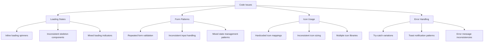
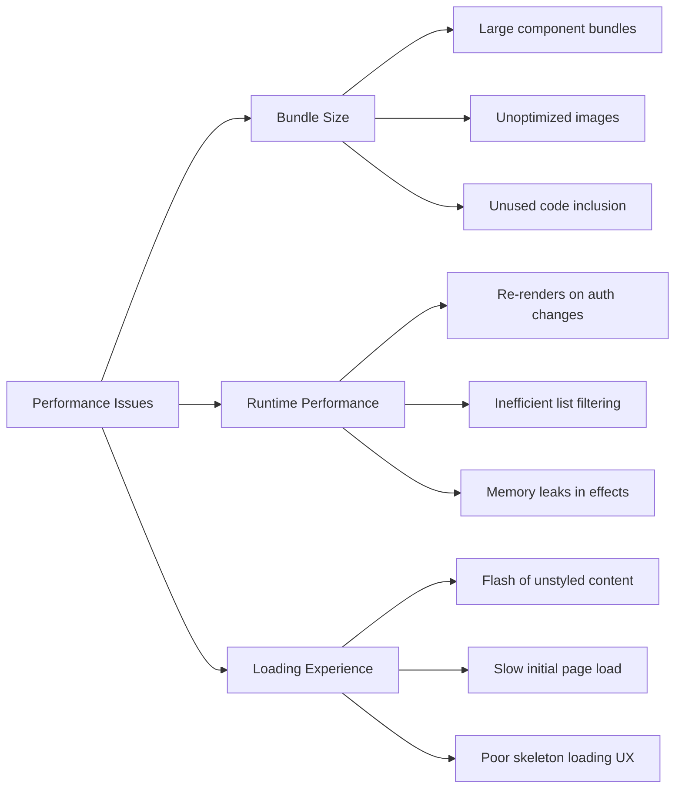
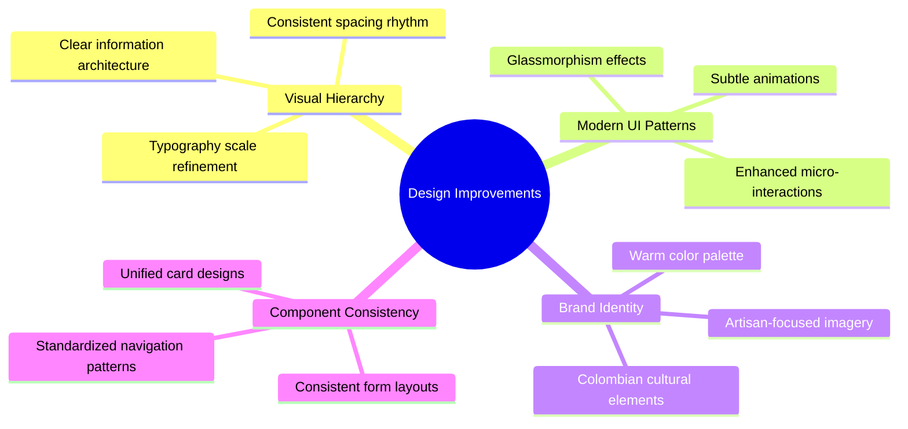
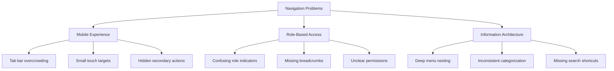
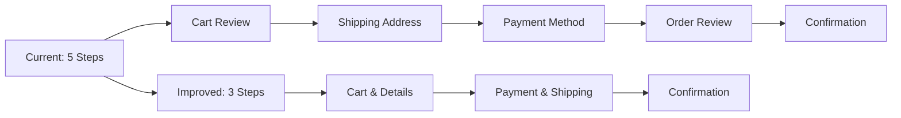
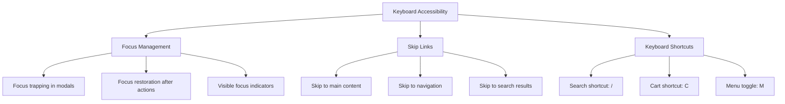
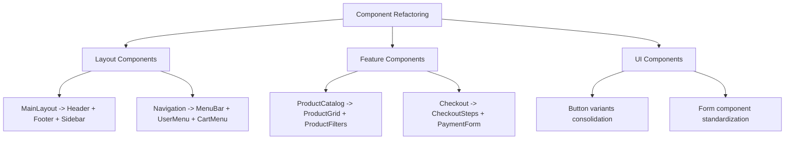
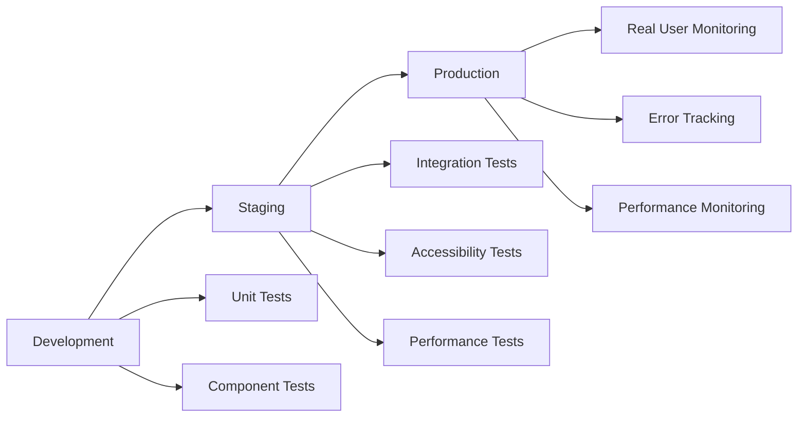

# Frontend Improvement Plan - Tesoros Chocó

## Overview

This document presents a comprehensive analysis and improvement plan for the Tesoros Chocó e-commerce platform frontend. The project is a React-based marketplace connecting artisans from Chocó with customers, featuring role-based access (admin, buyer, vendor) and modern UI components.

## Technology Stack Analysis

**Current Stack:**
- **Frontend Framework:** React 18 with TypeScript
- **Build Tool:** Vite for fast development and optimized builds
- **Styling:** Tailwind CSS with shadcn/ui component library
- **State Management:** React Context API (AuthContext, CartContext)
- **Backend Integration:** Supabase (authentication, database, real-time)
- **Package Manager:** Bun 1.0.0
- **Testing:** Vitest with @testing-library/react

**Architecture Pattern:** Component-based architecture with role-specific modules

## Code Audit Results

### Strengths
- Well-structured component hierarchy with clear separation of concerns
- Comprehensive design system with semantic color tokens
- Proper TypeScript implementation with strict type checking
- Good accessibility practices with ARIA attributes and semantic HTML
- Efficient caching system with custom hooks
- Proper error boundaries and loading states
- Mobile-first responsive design approach

### Code Quality Issues

#### Duplications and Inconsistencies


#### Architecture Problems
1. **Component Bloat:** MainLayout.tsx (236 lines) and ProductCatalog.tsx (550 lines) are too large
2. **Mixed Responsibilities:** Components handling both UI and business logic
3. **State Management:** Over-reliance on useState for complex state
4. **Performance:** Missing React.memo and useMemo optimizations in key components

#### Code Smells
- **Magic Numbers:** Hard-coded values throughout components
- **Deep Nesting:** Complex conditional rendering in JSX
- **Prop Drilling:** Auth state passed through multiple levels
- **Dead Code:** Unused imports and commented code blocks

### Performance Issues

#### Current Performance Bottlenecks


## Interface and Appearance Analysis

### Current Visual State
The application uses a well-structured design system with semantic tokens but suffers from:

#### Visual Inconsistencies
- **Typography Hierarchy:** Inconsistent heading usage across modules
- **Spacing System:** Mixed spacing values not following design tokens
- **Color Usage:** Legacy color variables mixed with new semantic tokens
- **Component Variants:** Inconsistent button and card styling

#### Modern Design Opportunities


### Proposed Design System Enhancement

#### Color Palette Modernization
```css
/* Enhanced Color System */
:root {
  /* Primary Brand Colors - Inspired by Colombian Chocó */
  --color-primary-choco: #8B4513;      /* Rich chocolate brown */
  --color-secondary-emerald: #00a67e;   /* Colombian emerald green */
  --color-accent-gold: #DAA520;         /* Artisan gold */
  
  /* Surface Colors - Modern neutrals */
  --color-surface-glass: rgba(255, 255, 255, 0.85);
  --color-surface-elevated: #ffffff;
  --color-surface-dimmed: rgba(0, 0, 0, 0.05);
  
  /* Interactive States */
  --color-interactive-hover: rgba(0, 166, 126, 0.1);
  --color-interactive-active: rgba(0, 166, 126, 0.2);
  --color-interactive-focus: rgba(0, 166, 126, 0.3);
}
```

#### Typography Enhancement
```css
/* Modern Typography Scale */
.typography-display {
  font-family: 'Manrope', sans-serif;
  font-weight: 800;
  line-height: 1.2;
  letter-spacing: -0.02em;
}

.typography-heading {
  font-family: 'Manrope', sans-serif;
  font-weight: 700;
  line-height: 1.3;
  letter-spacing: -0.01em;
}

.typography-body {
  font-family: 'Manrope', sans-serif;
  font-weight: 400;
  line-height: 1.6;
}
```

## User Experience (UX) Improvements

### Current UX Friction Points

#### Navigation Issues


#### User Flow Improvements

##### 1. Enhanced Product Discovery
- **Smart Filters:** AI-powered category suggestions
- **Visual Search:** Image-based product finding
- **Personalization:** User preference-based recommendations

##### 2. Streamlined Checkout Process


##### 3. Improved Empty States
```javascript
// Enhanced Empty State Component
const EmptyStatePattern = {
  illustration: "Contextual SVG illustration",
  primaryMessage: "Clear, actionable headline",
  secondaryMessage: "Helpful explanation",
  primaryAction: "Main CTA button",
  secondaryAction: "Alternative action link"
}
```

### Micro-interactions and Feedback

#### Loading States Enhancement
```javascript
// Standardized Loading Patterns
const LoadingPatterns = {
  skeleton: "Content-aware skeleton screens",
  shimmer: "Subtle shimmer animations",
  progressive: "Progressive image loading",
  contextual: "Context-specific loading states"
}
```

#### Interactive Feedback
- **Button States:** Hover, active, loading, disabled with smooth transitions
- **Form Validation:** Real-time feedback with clear error messages
- **Progress Indicators:** Step-by-step progress for multi-step processes
- **Success Animations:** Celebratory animations for completed actions

## Dark/Light Mode Implementation

### Current State Analysis
The existing theme implementation has several issues:
- **Incomplete Coverage:** Not all components properly support dark mode
- **Storage Issues:** Theme preference not consistently persisted
- **Transition Problems:** Jarring theme switches without smooth transitions
- **Accessibility Concerns:** Insufficient contrast ratios in dark mode

### Enhanced Theme System

#### Improved Theme Architecture
```typescript
// Enhanced Theme Provider
interface ThemeConfig {
  mode: 'light' | 'dark' | 'system';
  accentColor: string;
  fontSize: 'sm' | 'md' | 'lg';
  reducedMotion: boolean;
}

const useTheme = () => {
  const [config, setConfig] = useLocalStorage<ThemeConfig>('theme-config', {
    mode: 'system',
    accentColor: '#00a67e',
    fontSize: 'md',
    reducedMotion: false
  });
  
  // System preference detection and auto-switching
  const systemTheme = useMediaQuery('(prefers-color-scheme: dark)');
  const effectiveTheme = config.mode === 'system' ? systemTheme : config.mode;
  
  return { config, setConfig, effectiveTheme };
};
```

#### CSS Custom Properties Strategy
```css
/* Improved CSS Variables for Theme Switching */
:root {
  /* Light Theme */
  --color-background: 255 255 255;
  --color-foreground: 15 23 42;
  --color-card: 255 255 255;
  --color-border: 226 232 240;
}

[data-theme="dark"] {
  /* Dark Theme */
  --color-background: 15 23 42;
  --color-foreground: 248 250 252;
  --color-card: 30 41 59;
  --color-border: 51 65 85;
}

/* Smooth transitions */
* {
  transition: background-color 0.2s ease, color 0.2s ease, border-color 0.2s ease;
}
```

#### Component Theme Compliance
All components will be audited and updated to support both themes:
- **Color Contrast:** WCAG AA compliance for both themes
- **Image Handling:** Theme-appropriate image variants
- **Icon Consistency:** Properly themed icons across all states

## Accessibility and Interaction Improvements

### Current Accessibility Audit

#### Strengths
- Semantic HTML usage in most components
- ARIA attributes in interactive elements
- Keyboard navigation support in navigation components
- Screen reader friendly content structure

#### Areas for Improvement

##### 1. Keyboard Navigation


##### 2. Screen Reader Optimization
- **Live Regions:** Announce dynamic content changes
- **Descriptive Labels:** Enhanced ARIA labels for complex interactions
- **Content Structure:** Improved heading hierarchy

##### 3. Motor Accessibility
- **Touch Targets:** Minimum 44px touch targets on mobile
- **Gesture Alternatives:** Button alternatives for swipe actions
- **Timeout Extensions:** Configurable session timeouts

### Animation and Transitions

#### Motion Design Principles
```css
/* Motion preferences respect */
@media (prefers-reduced-motion: reduce) {
  * {
    animation-duration: 0.01ms !important;
    animation-iteration-count: 1 !important;
    transition-duration: 0.01ms !important;
    scroll-behavior: auto !important;
  }
}

/* Smooth micro-interactions */
.button {
  transition: all 0.2s cubic-bezier(0.4, 0, 0.2, 1);
}

.button:hover {
  transform: translateY(-1px);
  box-shadow: 0 4px 12px rgba(0, 0, 0, 0.15);
}
```

#### Responsive Design Enhancement

##### Mobile-First Improvements
```css
/* Enhanced Mobile Navigation */
.mobile-nav {
  position: fixed;
  bottom: 0;
  left: 0;
  right: 0;
  background: rgba(255, 255, 255, 0.95);
  backdrop-filter: blur(20px);
  border-top: 1px solid rgba(0, 0, 0, 0.1);
}

/* Improved touch targets */
.touch-target {
  min-height: 44px;
  min-width: 44px;
  display: flex;
  align-items: center;
  justify-content: center;
}
```

##### Tablet Optimization
- **Grid Layouts:** Optimized product grids for tablet viewports
- **Navigation:** Collapsible sidebar navigation for better space usage
- **Form Layouts:** Side-by-side form layouts for better UX

## Implementation Plan

### Phase 1: Quick Wins (1-2 weeks)

#### 1.1 Component Optimization
- **Extract Reusable Components:** Break down large components
- **Standardize Loading States:** Implement consistent skeleton screens
- **Fix Theme Issues:** Complete dark mode implementation

#### 1.2 Performance Quick Fixes
- **Image Optimization:** Add lazy loading and proper sizing
- **Bundle Analysis:** Remove unused dependencies
- **React.memo Implementation:** Add memoization to expensive components

#### 1.3 UX Improvements
```javascript
// Quick UX enhancements
const quickWins = [
  "Add loading states to all async operations",
  "Implement proper error boundaries",
  "Standardize form validation feedback",
  "Add success animations for user actions",
  "Improve empty state designs"
];
```

### Phase 2: Intermediate Changes (3-4 weeks)

#### 2.1 Design System Consolidation
- **Component Library Audit:** Standardize all UI components
- **Typography System:** Implement consistent typography scale
- **Color System:** Migrate to new semantic color tokens
- **Spacing System:** Implement consistent spacing rhythm

#### 2.2 Component Architecture Refactoring


#### 2.3 State Management Improvements
- **Context Optimization:** Reduce re-renders with context splitting
- **Custom Hooks:** Extract business logic to reusable hooks
- **Form State:** Implement proper form state management

### Phase 3: Structural Improvements (4-6 weeks)

#### 3.1 Architecture Modernization
- **Micro-frontend Preparation:** Modularize major features
- **Performance Monitoring:** Implement Core Web Vitals tracking
- **Error Tracking:** Enhance error reporting and recovery

#### 3.2 Advanced UX Features
```javascript
// Advanced UX implementations
const advancedFeatures = {
  searchExperience: {
    autoComplete: "Real-time search suggestions",
    visualSearch: "Image-based product search",
    voiceSearch: "Voice input capability"
  },
  personalization: {
    recommendations: "AI-powered product suggestions",
    preferences: "User customization options",
    accessibility: "Adaptive interface based on user needs"
  },
  interactions: {
    gestureSupport: "Touch gestures for mobile",
    keyboardShortcuts: "Power user keyboard navigation",
    dragAndDrop: "Intuitive drag interactions"
  }
};
```

#### 3.3 Accessibility Compliance
- **WCAG 2.1 AA:** Full compliance audit and implementation
- **Screen Reader Testing:** Comprehensive testing with assistive technologies
- **Keyboard Navigation:** Complete keyboard accessibility

## Component Refactoring Strategy

### High-Impact Refactoring Targets

#### 1. MainLayout Component Breakdown
```typescript
// Current: 236 lines monolithic component
// Proposed: Modular composition

// MainLayout.tsx (50 lines)
const MainLayout: FC<MainLayoutProps> = ({ children, className }) => {
  return (
    <div className="min-h-screen bg-background">
      <Header />
      <main className={cn("flex-1", className)}>{children}</main>
      <Footer />
      <MobileTabBar />
      <GlobalModals />
    </div>
  );
};

// Header.tsx (80 lines)
const Header: FC = () => (
  <header className="sticky top-0 z-50">
    <Navbar />
  </header>
);

// Footer.tsx (120 lines) 
const Footer: FC = () => (
  <footer className="border-t bg-card">
    <FooterContent />
    <FooterBottom />
  </footer>
);
```

#### 2. ProductCatalog Decomposition
```typescript
// Current: 550 lines mega-component
// Proposed: Feature-focused components

// ProductCatalog.tsx (100 lines)
const ProductCatalog: FC = () => {
  return (
    <div className="container py-8">
      <CatalogHeader />
      <div className="grid grid-cols-1 lg:grid-cols-4 gap-6">
        <ProductFilters />
        <ProductGrid className="lg:col-span-3" />
      </div>
    </div>
  );
};

// ProductFilters.tsx (150 lines)
// ProductGrid.tsx (100 lines)  
// ProductCard.tsx (80 lines)
// CatalogHeader.tsx (60 lines)
```

### Component Design Patterns

#### 1. Compound Components Pattern
```typescript
// Enhanced Card Component System
const Card = {
  Root: CardRoot,
  Header: CardHeader,
  Content: CardContent,
  Footer: CardFooter,
  Media: CardMedia
};

// Usage
<Card.Root>
  <Card.Media src="/image.jpg" alt="Product" />
  <Card.Header>
    <Card.Title>Product Name</Card.Title>
    <Card.Subtitle>Category</Card.Subtitle>
  </Card.Header>
  <Card.Content>
    Description content
  </Card.Content>
  <Card.Footer>
    <Button>Add to Cart</Button>
  </Card.Footer>
</Card.Root>
```

#### 2. Render Props Pattern for Data Components
```typescript
// Flexible data fetching component
const ProductData: FC<ProductDataProps> = ({ 
  productId, 
  children 
}) => {
  const { data, loading, error } = useProduct(productId);
  
  return children({ data, loading, error });
};

// Usage
<ProductData productId={id}>
  {({ data, loading, error }) => (
    <>
      {loading && <ProductSkeleton />}
      {error && <ErrorMessage error={error} />}
      {data && <ProductDetails product={data} />}
    </>
  )}
</ProductData>
```

## Testing Strategy Enhancement

### Current Testing Gaps
- **Component Testing:** Missing tests for complex components
- **Integration Testing:** No end-to-end user flow tests
- **Accessibility Testing:** No automated a11y testing
- **Performance Testing:** No performance regression testing

### Proposed Testing Structure
```typescript
// Component Testing Example
describe('ProductCard', () => {
  it('displays product information correctly', () => {
    render(<ProductCard product={mockProduct} />);
    expect(screen.getByRole('heading')).toHaveTextContent(mockProduct.name);
  });
  
  it('handles add to cart interaction', async () => {
    const user = userEvent.setup();
    const mockAdd = jest.fn();
    
    render(<ProductCard product={mockProduct} onAddToCart={mockAdd} />);
    await user.click(screen.getByRole('button', { name: /add to cart/i }));
    
    expect(mockAdd).toHaveBeenCalledWith(mockProduct.id);
  });
  
  it('meets accessibility standards', async () => {
    const { container } = render(<ProductCard product={mockProduct} />);
    const results = await axe(container);
    expect(results).toHaveNoViolations();
  });
});
```

## Quality Assurance Metrics

### Performance Targets
```javascript
const performanceTargets = {
  coreWebVitals: {
    LCP: "< 2.5s",  // Largest Contentful Paint
    FID: "< 100ms", // First Input Delay  
    CLS: "< 0.1"    // Cumulative Layout Shift
  },
  lighthouse: {
    performance: "> 90",
    accessibility: "> 95", 
    bestPractices: "> 90",
    seo: "> 90"
  },
  bundleSize: {
    initialLoad: "< 300KB",
    asyncChunks: "< 100KB each"
  }
};
```

### Code Quality Standards
- **TypeScript Strict Mode:** No implicit any types
- **ESLint Rules:** Airbnb configuration with custom rules
- **Test Coverage:** > 80% component coverage
- **Bundle Analysis:** Regular dependency audit

## Deployment and Monitoring

### Deployment Strategy


### Monitoring Implementation
- **Error Tracking:** Sentry integration for error monitoring
- **Performance:** Core Web Vitals tracking with custom metrics
- **User Analytics:** Privacy-compliant user behavior tracking
- **A/B Testing:** Feature flag system for gradual rollouts

## Risk Assessment and Mitigation

### Technical Risks
1. **Breaking Changes:** Potential disruption during refactoring
   - **Mitigation:** Feature flags and gradual rollout
2. **Performance Regression:** New features impacting performance
   - **Mitigation:** Performance budgets and continuous monitoring
3. **Accessibility Regression:** Changes breaking accessibility
   - **Mitigation:** Automated accessibility testing in CI/CD

### User Experience Risks
1. **Change Resistance:** Users adapting to new interface
   - **Mitigation:** Gradual UI changes with user feedback loops
2. **Mobile Compatibility:** Ensuring cross-device consistency
   - **Mitigation:** Comprehensive device testing matrix

## Success Criteria

### Quantitative Metrics
```javascript
const successMetrics = {
  performance: {
    pageLoadTime: "Reduce by 40%",
    bounceRate: "Reduce by 25%",
    conversionRate: "Increase by 15%"
  },
  usability: {
    taskCompletionRate: "> 90%",
    userSatisfactionScore: "> 4.5/5",
    supportTickets: "Reduce by 30%"
  },
  technical: {
    codeQuality: "Maintainability index > 70",
    testCoverage: "> 80%",
    buildTime: "< 2 minutes"
  }
};
```

### Qualitative Indicators
- **Developer Experience:** Improved development velocity and satisfaction
- **User Feedback:** Positive user reviews and feedback scores
- **Business Impact:** Increased user engagement and sales conversion
- **Accessibility:** Compliance with WCAG 2.1 AA standards


