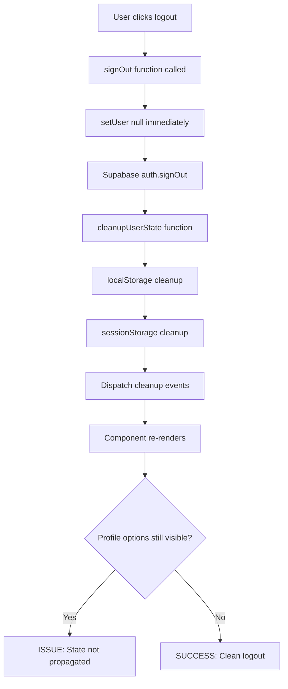
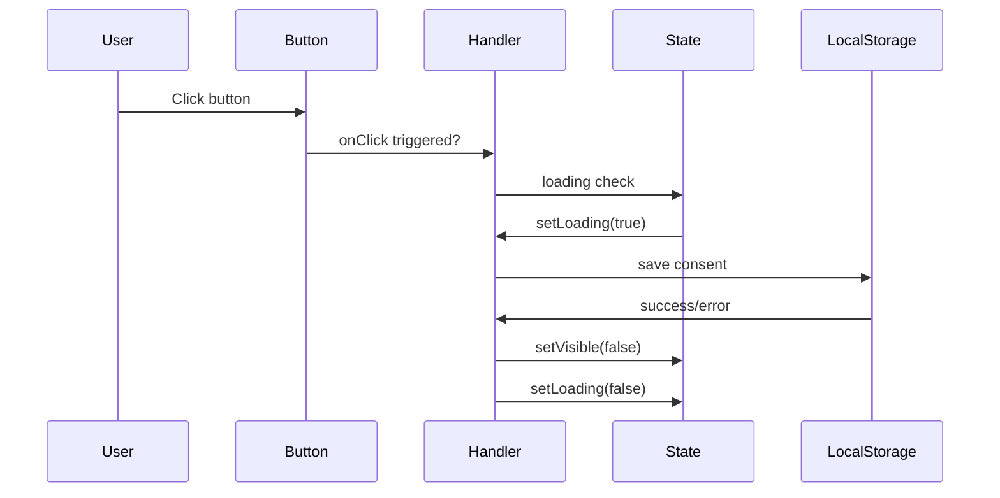

# Interface Debugging Guide - Plan de Revisión de Código

## Overview

Este documento proporciona un plan detallado de revisión de código para diagnosticar y resolver dos problemas principales en la interfaz de usuario:

1. **Persistencia de opciones de perfil después del logout**
2. **Botones no funcionales en el componente de consentimiento de cookies**

El enfoque está específicamente en el comportamiento de la interfaz y componentes, sin modificar la configuración de Supabase.

## Repository Context

**Tipo de Proyecto**: Full-Stack Application (React + Supabase + TypeScript)
- Frontend: React + Vite + TypeScript + Tailwind CSS
- Gestión de Estado: React Context API
- Backend: Supabase (Authentication, Database, Functions)
- UI Components: shadcn/ui + Radix UI

## Problem Analysis

### Problema 1: Persistencia de Opciones de Perfil Post-Logout

**Síntomas Observados**:
- Después del logout, las opciones del perfil del usuario permanecen visibles
- Se superponen con las opciones por defecto de la aplicación
- El estado del usuario no se limpia correctamente

**Causas Potenciales**:
- Estado local no sincronizado con el estado de autenticación
- Componentes que no reaccionan a cambios en AuthContext
- Caché de componentes manteniendo estado obsoleto
- Eventos de limpieza no disparados correctamente

### Problema 2: Botones No Funcionales en CookieConsent

**Síntomas Observados**:
- Los botones "Aceptar" y "Rechazar" no responden al clic
- No hay acción visible cuando se presionan
- El componente puede estar renderizado pero sin handlers funcionando

**Causas Potenciales**:
- Event handlers no vinculados correctamente
- Problemas con el estado loading que bloquea interacciones
- Conflictos de z-index o elementos superpuestos
- Problemas en la propagación de eventos

## Debugging Methodology

### Fase 1: Análisis de Logout - Gestión de Estado

#### 1.1 Verificación del Flujo de AuthContext

**Archivos a revisar**:
- `Frontend/src/auth/AuthContext.tsx` (líneas 370-450)
- `Frontend/src/lib/stateCleanup.ts`
- `Frontend/src/modules/App.tsx`

**Aspectos a verificar**:



**Puntos de inspección**:
1. **Estado inmediato**: Verificar que `setUser(null)` se ejecute inmediatamente
2. **Propagación de contexto**: Confirmar que todos los componentes consuman AuthContext correctamente
3. **Limpieza de localStorage**: Revisar que `cleanupUserState` remueva todas las claves de usuario
4. **Eventos de notificación**: Verificar que se disparen eventos `storage` y `userLoggedOut`

#### 1.2 Verificación de Componentes que Consumen AuthContext

**Archivos a revisar**:
- `Frontend/src/modules/buyer/BuyerProfile.tsx`
- `Frontend/src/modules/admin/AdminDashboard.tsx`
- `Frontend/src/components/ui/Layout/*`

**Técnicas de debugging**:

```javascript
// En cada componente, agregar logging temporal
const { user, loading } = useAuth();

useEffect(() => {
  console.log('[ComponentName] Auth state changed:', { user, loading });
}, [user, loading]);

// Verificar dependencias en useEffect
useEffect(() => {
  // Código del componente
}, [user]); // ¿Está user en las dependencias?
```

#### 1.3 Debugging de Renderizado Condicional

**Patrón a verificar**:
```javascript
// ¿Los componentes usan renderizado condicional correcto?
if (!user) return <DefaultView />;
if (loading) return <LoadingView />;
return <AuthenticatedView />;

// vs el problemático:
return (
  <>
    {!user && <DefaultView />}
    {user && <AuthenticatedView />} {/* Puede renderizar ambos */}
  </>
);
```

### Fase 2: Análisis de CookieConsent - Event Handling

#### 2.1 Verificación de Event Handlers

**Archivo principal**: `Frontend/src/components/ui/CookieConsent.tsx`

**Aspectos a verificar**:



**Puntos de inspección**:

1. **Event Binding**: Verificar que `onClick={handleAccept}` esté correctamente asignado
2. **Event Propagation**: Confirmar que `e.preventDefault()` y `e.stopPropagation()` funcionen
3. **Loading State**: Revisar si el estado `loading` bloquea múltiples clics
4. **Button Component**: Verificar la implementación del componente Button de shadcn

#### 2.2 Debugging del Componente Button

**Archivo a revisar**: `Frontend/src/components/ui/shadcn/button.tsx`

**Verificaciones**:
```javascript
// Confirmar que el Button forwarding funcione correctamente
const Button = React.forwardRef<
  HTMLButtonElement,
  React.ButtonHTMLAttributes<HTMLButtonElement> & VariantProps<typeof buttonVariants>
>(({ className, variant, size, asChild = false, ...props }, ref) => {
  const Comp = asChild ? Slot : "button"
  return (
    <Comp
      className={cn(buttonVariants({ variant, size, className }))}
      ref={ref}
      {...props} // ¿onClick se propaga correctamente?
    />
  )
})
```

#### 2.3 Debugging de Layout y Z-Index

**Verificaciones visuales**:
```css
/* Verificar en DevTools */
.cookie-consent-container {
  z-index: 50; /* ¿Está bloqueado por otro elemento? */
  pointer-events: auto; /* ¿Está deshabilitado? */
}

/* Verificar elementos superpuestos */
div[style*="pointer-events: none"] {
  /* ¿El decorative background bloquea clics? */
}
```

## Step-by-Step Debugging Plan

### Plan de Debugging para Logout (Problema 1)

#### Paso 1: Logging Comprehensivo
```javascript
// Agregar en AuthContext.tsx en signOut function
console.group('[AuthContext] LOGOUT DEBUGGING');
console.log('1. User state before logout:', user);
console.log('2. LocalStorage before cleanup:', Object.keys(localStorage));

// Después de setUser(null)
console.log('3. User state after setUser(null):', user);

// Después de cleanupUserState
console.log('4. LocalStorage after cleanup:', Object.keys(localStorage));
console.log('5. Cleanup result:', cleanupResult);
console.groupEnd();
```

#### Paso 2: Component State Tracking
```javascript
// En componentes que muestran opciones de perfil
const [debugInfo, setDebugInfo] = useState({});

useEffect(() => {
  const info = {
    timestamp: Date.now(),
    user: user,
    loading: loading,
    componentRendered: true
  };
  setDebugInfo(info);
  console.log('[ComponentName] State update:', info);
}, [user, loading]);

// Render debug info temporalmente
{process.env.NODE_ENV === 'development' && (
  <div style={{position: 'fixed', top: 0, right: 0, background: 'red', color: 'white', padding: '10px', fontSize: '12px', zIndex: 9999}}>
    <pre>{JSON.stringify(debugInfo, null, 2)}</pre>
  </div>
)}
```

#### Paso 3: Event Listener Verification
```javascript
// Verificar que los componentes escuchen eventos de logout
useEffect(() => {
  const handleUserLoggedOut = (event) => {
    console.log('[ComponentName] User logged out event received:', event.detail);
    // ¿Se ejecuta este handler?
  };

  const handleStorageChange = (event) => {
    console.log('[ComponentName] Storage change event:', event);
    // ¿Se ejecuta este handler?
  };

  window.addEventListener('userLoggedOut', handleUserLoggedOut);
  window.addEventListener('storage', handleStorageChange);

  return () => {
    window.removeEventListener('userLoggedOut', handleUserLoggedOut);
    window.removeEventListener('storage', handleStorageChange);
  };
}, []);
```

### Plan de Debugging para CookieConsent (Problema 2)

#### Paso 1: Event Handler Verification
```javascript
// Agregar logging detallado en handleAccept
const handleAccept = useCallback((e: React.MouseEvent) => {
  console.group('[CookieConsent] ACCEPT BUTTON DEBUG');
  console.log('1. Event object:', e);
  console.log('2. Event type:', e.type);
  console.log('3. Target element:', e.target);
  console.log('4. Current target:', e.currentTarget);
  console.log('5. Loading state:', loading);
  console.log('6. Button disabled:', e.currentTarget.disabled);
  
  e.preventDefault();
  e.stopPropagation();
  
  if (loading) {
    console.log('7. BLOCKED: Already processing');
    console.groupEnd();
    return;
  }
  
  console.log('8. Proceeding with setConsent');
  setConsent('accepted');
  console.groupEnd();
}, [loading, setConsent]);
```

#### Paso 2: DOM Inspection
```javascript
// Agregar en el render
useEffect(() => {
  // Verificar que el botón esté en el DOM y sea clickeable
  const buttons = document.querySelectorAll('[data-testid="cookie-accept"]');
  console.log('[CookieConsent] Accept buttons found:', buttons.length);
  
  buttons.forEach((button, index) => {
    console.log(`Button ${index}:`, {
      disabled: button.disabled,
      style: button.style.cssText,
      computedStyle: window.getComputedStyle(button),
      boundingRect: button.getBoundingClientRect()
    });
  });
}, [visible]);
```

#### Paso 3: Button Component Debug
```javascript
// Verificar en el Button component si es problema de Radix Slot
const Button = React.forwardRef<HTMLButtonElement, ButtonProps>(
  ({ className, variant, size, asChild = false, onClick, ...props }, ref) => {
    const Comp = asChild ? Slot : "button";
    
    // Debug wrapper
    const handleClick = (e: React.MouseEvent<HTMLButtonElement>) => {
      console.log('[Button] Click intercepted:', { asChild, onClick: !!onClick });
      if (onClick) {
        onClick(e);
      }
    };
    
    return (
      <Comp
        className={cn(buttonVariants({ variant, size, className }))}
        ref={ref}
        onClick={!asChild ? handleClick : onClick}
        {...props}
      />
    );
  }
);
```

## Key Files and Functions to Review

### Para el Problema de Logout

| Archivo | Función/Sección | Propósito |
|---------|----------------|-----------|
| `AuthContext.tsx` | `signOut()` | Función principal de logout |
| `AuthContext.tsx` | `useEffect` auth listener | Manejo de cambios de estado |
| `stateCleanup.ts` | `cleanupUserState()` | Limpieza centralizada |
| `stateCleanup.ts` | `validateCleanup()` | Validación post-limpieza |
| `App.tsx` | Routing logic | Redirección post-logout |
| `BuyerProfile.tsx` | `useAuth()` usage | Consumo de contexto |
| Layout components | Conditional rendering | Renderizado basado en auth |

### Para el Problema de CookieConsent

| Archivo | Función/Sección | Propósito |
|---------|----------------|-----------|
| `CookieConsent.tsx` | `handleAccept/handleReject` | Event handlers principales |
| `CookieConsent.tsx` | `setConsent()` | Lógica de guardado |
| `CookieConsent.tsx` | `useEffect` visibility | Control de visibilidad |
| `button.tsx` | `Button` component | Implementación base del botón |
| `button.tsx` | `asChild` prop handling | Composición con Radix Slot |

## Common Debugging Techniques

### 1. React Developer Tools

```javascript
// Usar React DevTools para:
// - Inspeccionar props y state en tiempo real
// - Verificar re-renders innecesarios
// - Trackear cambios en Context
// - Verificar component tree durante logout
```

### 2. Console Debugging Strategy

```javascript
// Patrón de debugging estructurado
console.group('[ComponentName] Operation');
console.log('Input:', input);
console.log('State before:', state);
// ... operación
console.log('State after:', newState);
console.log('Side effects:', effects);
console.groupEnd();
```

### 3. Breakpoint Strategy

```javascript
// Puntos estratégicos para breakpoints:
// 1. AuthContext.signOut() - línea setUser(null)
// 2. CookieConsent.handleAccept() - primera línea
// 3. cleanupUserState() - antes del forEach
// 4. Componentes que renderizan opciones - useEffect de auth
```

### 4. Network and Storage Monitoring

```javascript
// Monitorear cambios en tiempo real
const originalSetItem = localStorage.setItem;
localStorage.setItem = function(key, value) {
  console.log(`[localStorage] SET: ${key} = ${value}`);
  return originalSetItem.apply(this, arguments);
};

const originalRemoveItem = localStorage.removeItem;
localStorage.removeItem = function(key) {
  console.log(`[localStorage] REMOVE: ${key}`);
  return originalRemoveItem.apply(this, arguments);
};
```

## Testing Strategies

### Manual Testing Checklist

#### Para Logout:
- [ ] Login como usuario normal
- [ ] Verificar que opciones de perfil sean visibles
- [ ] Hacer logout
- [ ] Confirmar que opciones de perfil desaparezcan inmediatamente
- [ ] Verificar que opciones por defecto aparezcan
- [ ] Revisar localStorage en DevTools
- [ ] Probar refresh de página post-logout

#### Para CookieConsent:
- [ ] Limpiar localStorage completamente
- [ ] Recargar página
- [ ] Verificar que componente sea visible
- [ ] Intentar click en "Rechazar"
- [ ] Verificar respuesta visual
- [ ] Intentar click en "Aceptar"
- [ ] Verificar que componente desaparezca
- [ ] Verificar entrada en localStorage

### Automated Testing Considerations

```typescript
// Test para logout state cleanup
describe('Auth Logout', () => {
  it('should clear user state immediately', () => {
    // Setup authenticated user
    // Trigger logout
    // Assert user is null
    // Assert localStorage is cleaned
  });
});

// Test para cookie consent
describe('CookieConsent', () => {
  it('should handle button clicks', () => {
    render(<CookieConsent />);
    const acceptButton = screen.getByTestId('cookie-accept');
    fireEvent.click(acceptButton);
    // Assert localStorage updated
    // Assert component hidden
  });
});
```

## Best Practices para Prevenir Problemas Futuros

### 1. Gestión de Estado Centralizada

```typescript
// Crear hooks personalizados para estado crítico
const useAuthState = () => {
  const { user, loading } = useAuth();
  
  // Debugging en desarrollo
  useEffect(() => {
    if (process.env.NODE_ENV === 'development') {
      console.log('[useAuthState] State change:', { user: !!user, loading });
    }
  }, [user, loading]);
  
  return { user, loading, isAuthenticated: !!user };
};
```

### 2. Event Handling Robusto

```typescript
// Patrón para event handlers seguros
const createSafeHandler = (handler: Function, context: string) => {
  return useCallback((...args: any[]) => {
    try {
      console.log(`[${context}] Handler called`);
      return handler(...args);
    } catch (error) {
      console.error(`[${context}] Handler error:`, error);
      // Opcional: reportar error
    }
  }, [handler]);
};

// Uso
const handleAccept = createSafeHandler(
  (e: React.MouseEvent) => {
    e.preventDefault();
    setConsent('accepted');
  },
  'CookieConsent.Accept'
);
```

### 3. Validación de Estado Consistente

```typescript
// Hook para validar consistencia de estado
const useStateValidation = () => {
  const { user } = useAuth();
  
  useEffect(() => {
    // Validar que el estado sea consistente
    const validateState = () => {
      const hasLocalStorageUser = localStorage.getItem('user_preferences');
      const hasAuthUser = !!user;
      
      if (hasLocalStorageUser && !hasAuthUser) {
        console.warn('[StateValidation] Inconsistent state detected');
        // Limpiar estado huérfano
        cleanupUserState({ emergency: true });
      }
    };
    
    validateState();
  }, [user]);
};
```

### 4. Component Lifecycle Monitoring

```typescript
// HOC para monitorear componentes críticos
const withLifecycleLogging = <P extends object>(
  Component: React.ComponentType<P>,
  name: string
) => {
  return (props: P) => {
    useEffect(() => {
      console.log(`[${name}] Mounted`);
      return () => console.log(`[${name}] Unmounted`);
    }, []);
    
    return <Component {...props} />;
  };
};

// Uso en componentes críticos
export default withLifecycleLogging(CookieConsent, 'CookieConsent');
```

### 5. Error Boundaries para UI Crítica

```typescript
// Error boundary específico para componentes de UI críticos
class UIComponentErrorBoundary extends React.Component {
  state = { hasError: false, error: null };
  
  static getDerivedStateFromError(error: Error) {
    return { hasError: true, error };
  }
  
  componentDidCatch(error: Error, errorInfo: React.ErrorInfo) {
    console.error('[UIErrorBoundary] Component error:', error, errorInfo);
    // Reportar error si es necesario
  }
  
  render() {
    if (this.state.hasError) {
      return (
        <div style={{ padding: '20px', border: '1px solid red' }}>
          <h3>Component Error</h3>
          <p>Something went wrong with this UI component.</p>
          <button onClick={() => this.setState({ hasError: false })}>
            Try Again
          </button>
        </div>
      );
    }
    
    return this.props.children;
  }
}
```

### 6. Standardized Logging

```typescript
// Sistema de logging estandarizado
class Logger {
  static prefix = (component: string) => `[${component}]`;
  
  static auth = {
    login: (msg: string, data?: any) => 
      console.log(`${Logger.prefix('Auth')} Login: ${msg}`, data),
    logout: (msg: string, data?: any) => 
      console.log(`${Logger.prefix('Auth')} Logout: ${msg}`, data),
    error: (msg: string, error?: Error) => 
      console.error(`${Logger.prefix('Auth')} Error: ${msg}`, error)
  };
  
  static ui = {
    interaction: (component: string, action: string, data?: any) => 
      console.log(`${Logger.prefix(component)} ${action}:`, data),
    error: (component: string, error: Error) => 
      console.error(`${Logger.prefix(component)} Error:`, error)
  };
}

// Uso
Logger.auth.logout('State cleanup initiated', { userExists: !!user });
Logger.ui.interaction('CookieConsent', 'Accept clicked', { loading });
```

## Conclusión

Este plan de revisión de código proporciona un enfoque sistemático para diagnosticar y resolver los problemas de interfaz identificados. La metodología se centra en:

1. **Debugging metódico** con logging estructurado
2. **Verificación paso a paso** del flujo de datos
3. **Identificación de puntos de falla** específicos
4. **Implementación de mejores prácticas** preventivas

Al seguir estos pasos, deberías poder identificar las causas raíz de ambos problemas y implementar soluciones duraderas que prevengan recurrencias futuras.