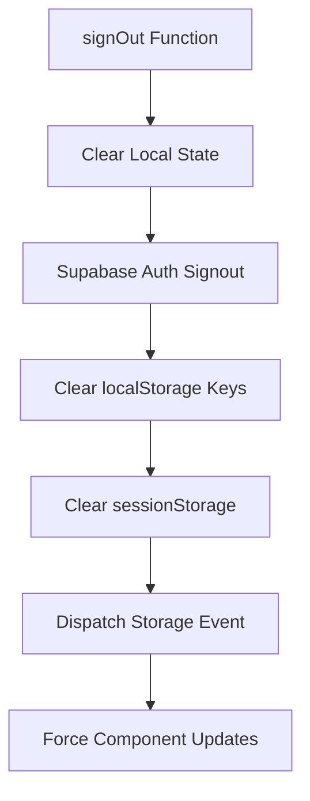
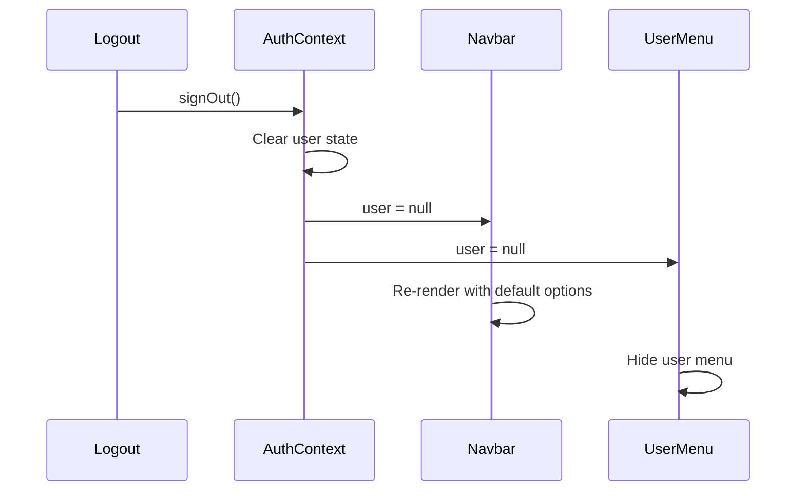
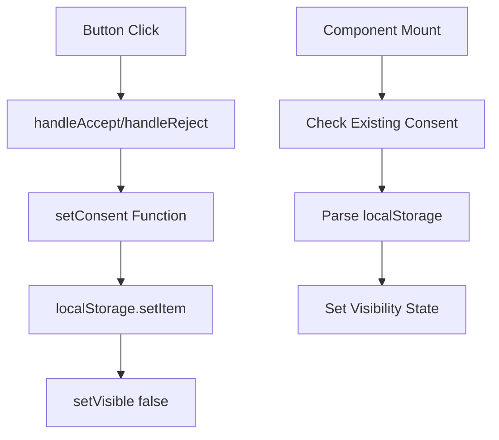
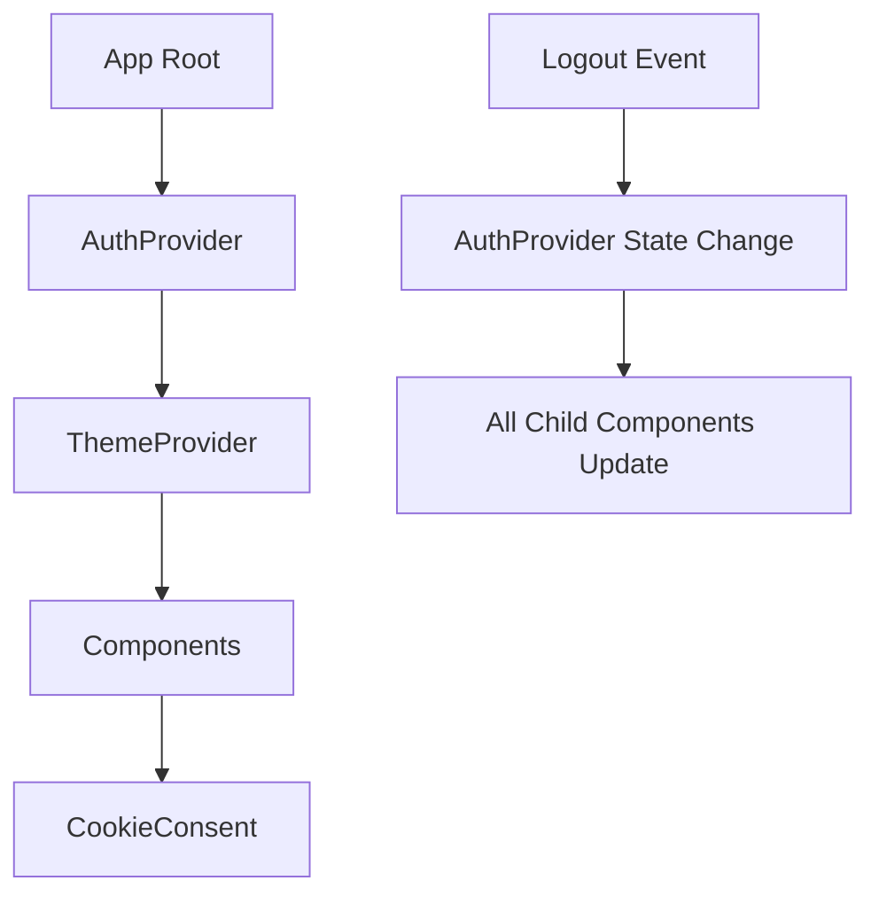

# Code Review Plan: Logout and Cookie Consent Debugging

## Overview

This document provides a systematic code review plan to debug two critical issues in your React application:
1. **Logout Issue**: Profile options from logged-out users persist and overlap with default application options
2. **Cookie Consent Issue**: Cookie consent buttons are unresponsive and don't register clicks

## Issue Analysis

### Issue 1: Logout State Persistence
**Symptoms**: After logout, user-specific profile options remain visible and interfere with default UI
**Suspected Causes**: State management inconsistencies, caching issues, incomplete state cleanup, component re-render problems

### Issue 2: Cookie Consent Button Failure
**Symptoms**: Cookie consent buttons don't respond to clicks
**Suspected Causes**: Event handler issues, JavaScript errors, DOM manipulation problems, z-index conflicts

## Systematic Code Review Plan

### Phase 1: Authentication State Management Review

#### 1.1 AuthContext Analysis
**File**: `Frontend/src/auth/AuthContext.tsx`

**Key Review Points**:


**Specific Checks**:
- [ ] **Line 369-400**: Verify `signOut()` function completely clears all user state
- [ ] **Line 373-375**: Confirm immediate state cleanup: `setUser(null)`, `setLoading(true)`, `setProfileLoading('')`
- [ ] **Line 387-399**: Review localStorage cleanup logic - check if all user-specific keys are removed
- [ ] **Line 406**: Verify `sessionStorage.clear()` is executed
- [ ] **Line 409**: Check if storage event is properly dispatched to trigger component updates

**Critical Questions**:
1. Are there any user-specific keys in localStorage that aren't being cleared?
2. Is the storage event listener in components properly responding to logout?
3. Could there be a race condition between state updates and component re-renders?

#### 1.2 Component State Response to Logout
**Files to Review**:
- `Frontend/src/components/ui/Layout/Navbar.tsx` (Lines 32-40)
- `Frontend/src/components/ui/Layout/UserMenu.tsx` (Lines 1-50)

**Review Checklist**:


- [ ] **Navbar.tsx Line 32-40**: Check storage event listener implementation
- [ ] **UserMenu.tsx Line 37-40**: Verify loading state handling during logout
- [ ] **UserMenu.tsx Line 25-29**: Review if component properly unmounts when user becomes null

### Phase 2: Cache and Storage Investigation

#### 2.1 Browser Storage Audit
**Manual Testing Checklist**:
- [ ] Open Browser DevTools → Application → Local Storage
- [ ] Before logout, document all keys with user-specific data
- [ ] Perform logout
- [ ] Verify which keys remain after logout
- [ ] Check Session Storage and IndexedDB for persistent data

#### 2.2 Component State Persistence
**Files to Investigate**:
```typescript
// Check these components for state that might persist after logout:
- CartContext.tsx (Lines 28-35) // Cart state clearing
- Theme providers and preferences
- Any custom hooks with internal state
- React Query/SWR caches if used
```

**Review Points**:
- [ ] **CartContext.tsx**: Verify cart clearing when user changes (Lines 28-35)
- [ ] Check if any components maintain internal state that should reset on logout
- [ ] Look for singleton patterns or global variables that might persist

### Phase 3: Cookie Consent Component Deep Dive

#### 3.1 Event Handler Analysis
**File**: `Frontend/src/components/ui/CookieConsent.tsx`

**Critical Review Areas**:


**Specific Checks**:
- [ ] **Lines 51-54**: Verify `handleAccept` function is properly bound
- [ ] **Lines 56-59**: Check `handleReject` function implementation
- [ ] **Lines 36-49**: Review `setConsent` function for error handling
- [ ] **Lines 121-132**: Inspect button onClick assignments

**Common Issues to Look For**:
```typescript
// Check for these patterns that could break event handlers:
1. Missing useCallback on handlers
2. Inline arrow functions causing re-renders
3. Event propagation issues (e.stopPropagation needed?)
4. Button disabled state interfering with clicks
5. CSS pointer-events: none on parent elements
```

#### 3.2 DOM and CSS Investigation
**Visual Debug Checklist**:
- [ ] **Line 67**: Check z-index value (currently z-50) - might be covered by other elements
- [ ] **Lines 74-83**: Verify backdrop-blur and background don't interfere with interactions
- [ ] **Lines 121-132**: Ensure buttons aren't overlapped by absolute positioned elements

### Phase 4: Component Integration Analysis

#### 4.1 Context Provider Hierarchy
**File**: Check the main App.tsx or root component

**Review Pattern**:


**Validation Points**:
- [ ] Ensure CookieConsent is properly wrapped in providers
- [ ] Check for provider order (AuthProvider should wrap others)
- [ ] Verify no circular dependencies between contexts

#### 4.2 React Strict Mode and Development Issues
**Check for**:
- [ ] Double-effect execution in development
- [ ] Component mounting/unmounting cycles
- [ ] State batching issues in React 18+

### Phase 5: Browser Compatibility and Environment Issues

#### 5.1 localStorage Access
**Debug Script** (Run in browser console):
```javascript
// Test localStorage functionality
try {
  localStorage.setItem('test', 'value');
  console.log('localStorage write: OK');
  localStorage.removeItem('test');
  console.log('localStorage delete: OK');
} catch (e) {
  console.error('localStorage error:', e);
}

// Test cookie consent specifically
try {
  const consent = localStorage.getItem('cookie_consent');
  console.log('Current consent:', consent);
} catch (e) {
  console.error('Consent read error:', e);
}
```

#### 5.2 Event System Testing
**Debug Script**:
```javascript
// Test event handling
document.addEventListener('click', (e) => {
  if (e.target.closest('[data-testid="cookie-accept"]')) {
    console.log('Cookie accept button clicked:', e.target);
  }
});
```

## Testing Strategy

### Automated Tests to Write

#### 5.1 Logout Flow Test
```typescript
describe('Logout Functionality', () => {
  test('should clear all user state on logout', async () => {
    // Setup authenticated user
    // Trigger logout
    // Verify state is cleared
    // Verify localStorage is cleaned
    // Verify UI shows default state
  });
});
```

#### 5.2 Cookie Consent Test
```typescript
describe('Cookie Consent', () => {
  test('should respond to button clicks', async () => {
    // Render component
    // Click accept button
    // Verify localStorage is updated
    // Verify component is hidden
  });
});
```

### Manual Testing Scenarios

#### 5.1 Logout Testing Protocol
1. **Setup**: Login with different user roles (admin, buyer, seller)
2. **Action**: Perform logout from different pages
3. **Verification**: 
   - Check UI immediately after logout
   - Refresh page and verify state
   - Check browser storage
   - Navigate to different routes

#### 5.2 Cookie Consent Testing Protocol
1. **Clean State**: Clear all localStorage
2. **Page Load**: Refresh page, verify cookie banner appears
3. **Interaction Testing**:
   - Click accept - verify banner disappears
   - Clear storage, reload, click reject - verify behavior
   - Test on different browsers and devices

## Best Practices for Prevention

### 1. State Management Guidelines

#### Centralized State Cleanup
```typescript
// Implement a centralized cleanup function
const clearAllUserData = () => {
  // Clear auth state
  setUser(null);
  
  // Clear all user-specific localStorage keys
  const userKeys = Object.keys(localStorage).filter(key => 
    key.includes('_user_') || key.includes('cart_') || key.includes('preferences_')
  );
  userKeys.forEach(key => localStorage.removeItem(key));
  
  // Clear session storage
  sessionStorage.clear();
  
  // Dispatch global state change event
  window.dispatchEvent(new CustomEvent('userStateCleared'));
};
```

#### Component State Reset Pattern
```typescript
// Use useEffect to reset component state on auth changes
useEffect(() => {
  if (!user) {
    // Reset component-specific state
    setLocalState(initialState);
    setFilters({});
    setCachedData(null);
  }
}, [user]);
```

### 2. Event Handler Best Practices

#### Stable Event Handlers
```typescript
// Use useCallback for event handlers
const handleAccept = useCallback(() => {
  setConsent('accepted');
}, []);

// Add defensive programming
const handleClick = useCallback((e: React.MouseEvent) => {
  e.preventDefault();
  e.stopPropagation();
  
  try {
    // Handle action
  } catch (error) {
    console.error('Handler error:', error);
  }
}, []);
```

#### Button Implementation
```typescript
// Ensure buttons are properly implemented
<Button
  onClick={handleAccept}
  disabled={loading}
  type="button"
  data-testid="cookie-accept"
>
  Accept
</Button>
```

### 3. State Persistence Strategy

#### Selective Persistence
```typescript
// Only persist necessary data with clear naming
const STORAGE_KEYS = {
  THEME: 'app_theme',
  LANGUAGE: 'app_language',
  COOKIE_CONSENT: 'cookie_consent',
  USER_CART: (userId: string) => `cart_${userId}`,
  USER_PREFERENCES: (userId: string) => `preferences_${userId}`
};

// Clear user-specific data on logout
const clearUserData = (userId: string) => {
  localStorage.removeItem(STORAGE_KEYS.USER_CART(userId));
  localStorage.removeItem(STORAGE_KEYS.USER_PREFERENCES(userId));
};
```

### 4. Component Architecture

#### Conditional Rendering
```typescript
// Use proper conditional rendering for user-dependent components
{user ? (
  <UserMenu user={user} onLogout={handleLogout} />
) : (
  <AuthButtons />
)}
```

#### Error Boundaries
```typescript
// Wrap critical components in error boundaries
<ErrorBoundary fallback={<DefaultErrorUI />}>
  <CookieConsent />
</ErrorBoundary>
```

### 5. Development Debugging

#### Enhanced Logging
```typescript
// Add structured logging for debugging
const logUserAction = (action: string, data?: any) => {
  if (import.meta.env.DEV) {
    console.log(`[User Action] ${action}`, {
      timestamp: new Date().toISOString(),
      userId: user?.id,
      data
    });
  }
};
```

#### State Validation
```typescript
// Validate state consistency
useEffect(() => {
  if (import.meta.env.DEV) {
    const hasUser = !!user;
    const hasUserData = !!localStorage.getItem('user_preferences');
    
    if (!hasUser && hasUserData) {
      console.warn('Inconsistent state: No user but user data exists');
    }
  }
}, [user]);
```

## Implementation Priority

### Immediate Actions (Critical Issues)
1. **Fix logout state cleanup** - Review and fix AuthContext signOut function
2. **Debug cookie consent buttons** - Add event handler debugging and fix interactions
3. **Add comprehensive logging** - Implement structured logging for both issues

### Short-term Improvements (1-2 weeks)
1. **Implement state validation** - Add consistency checks
2. **Add automated tests** - Cover logout and cookie consent scenarios
3. **Improve error handling** - Add error boundaries and better error reporting

### Long-term Enhancements (1 month+)
1. **Centralize state management** - Consider upgrading to more robust state solution
2. **Implement state persistence strategy** - Define clear rules for what persists and what doesn't
3. **Add performance monitoring** - Track state management performance

## Success Criteria

### Logout Issue Resolution
- [ ] User profile options completely disappear after logout
- [ ] Default application options display correctly after logout
- [ ] Page refresh after logout shows correct anonymous state
- [ ] No user-specific data persists in browser storage after logout

### Cookie Consent Issue Resolution
- [ ] Accept button successfully saves consent and hides banner
- [ ] Reject button successfully saves rejection and hides banner  
- [ ] Banner reappears correctly after clearing storage
- [ ] No JavaScript errors in console during button interactions

This comprehensive review plan should help you systematically identify and resolve both issues while establishing better practices for future development.