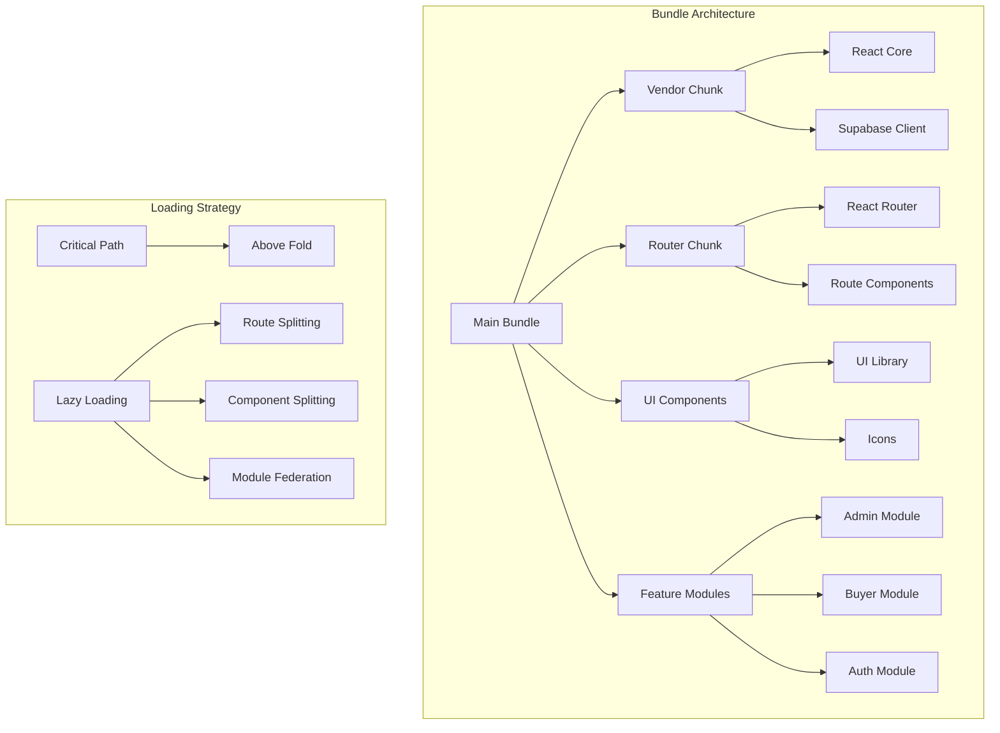
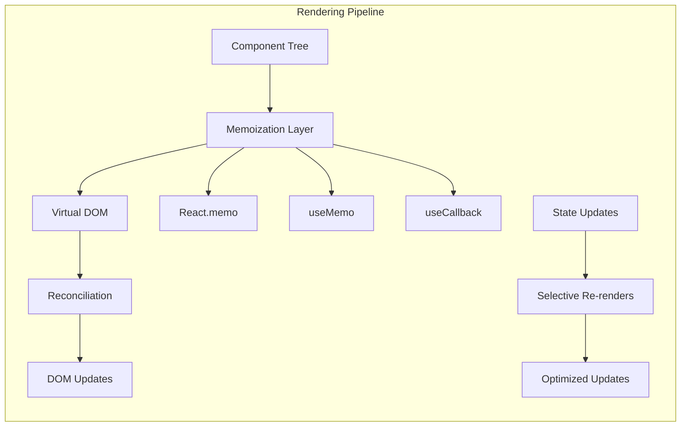
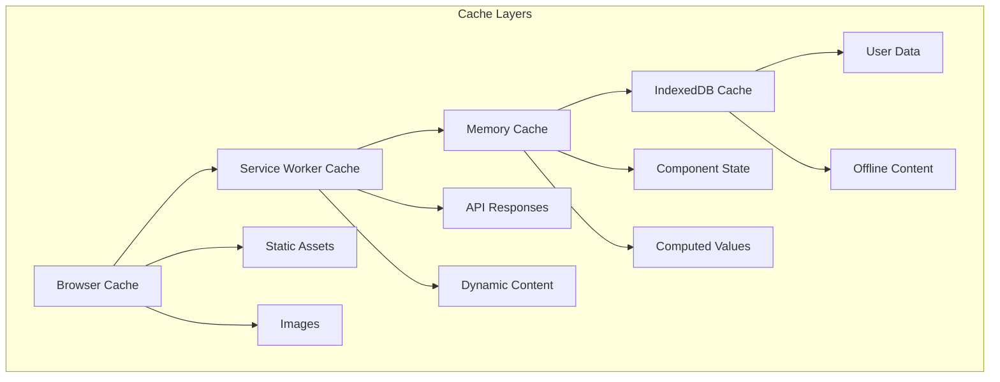

# Frontend Performance Optimization Design

## Overview

This document outlines a comprehensive performance optimization strategy for the Tesoros Chocó frontend application to significantly improve loading speeds, rendering performance, and overall user experience. The optimizations target Core Web Vitals metrics, bundle size reduction, efficient caching strategies, and runtime performance enhancements.

## Current Performance Analysis

### Existing Infrastructure
- **Frontend**: React 18 with Vite build system
- **Performance Monitoring**: Performance dashboard with Core Web Vitals tracking
- **Caching**: Service worker with basic caching strategies
- **Build Optimization**: Terser minification and basic code splitting

### Performance Challenges Identified
- Large initial bundle sizes affecting FCP (First Contentful Paint)
- Inefficient component re-rendering patterns
- Suboptimal image loading and optimization
- Limited prefetching and preloading strategies
- Insufficient lazy loading implementation

## Technology Stack & Dependencies

### Core Performance Technologies
- **Build Tool**: Vite with advanced optimization configurations
- **Bundle Analysis**: rollup-plugin-analyzer, webpack-bundle-analyzer
- **Code Splitting**: Dynamic imports with React.lazy()
- **Image Optimization**: Modern image formats (WebP, AVIF), lazy loading
- **Caching**: Enhanced service worker with sophisticated strategies
- **Performance Monitoring**: Web Vitals API, Performance Observer API

### New Dependencies
```json
{
  "devDependencies": {
    "@vitejs/plugin-legacy": "^5.0.0",
    "vite-plugin-pwa": "^0.17.0",
    "vite-plugin-compress": "^1.1.3",
    "rollup-plugin-analyzer": "^4.0.0"
  },
  "dependencies": {
    "react-intersection-observer": "^9.5.3",
    "react-window": "^1.8.8",
    "react-window-infinite-loader": "^1.0.9"
  }
}
```

## Architecture Optimizations

### Bundle Optimization Strategy



### Component Rendering Optimization



## Performance Enhancement Features

### 1. Advanced Code Splitting

#### Route-Based Splitting
```typescript
// Enhanced route splitting with preloading
const AdminDashboard = lazy(() => 
  import('../modules/admin/AdminDashboard').then(module => ({
    default: module.default
  }))
);

const ProductCatalog = lazy(() => 
  import('../modules/buyer/ProductCatalog').then(module => ({
    default: module.default
  }))
);
```

#### Component-Level Splitting
```typescript
// Heavy components with dynamic imports
const PerformanceDashboard = lazy(() => 
  import('../components/ui/PerformanceDashboard')
);

const DatabaseDashboard = lazy(() => 
  import('../components/ui/DatabaseDashboard')
);
```

### 2. Image Optimization System

#### Progressive Image Loading
```typescript
interface OptimizedImageProps {
  src: string;
  alt: string;
  priority?: boolean;
  sizes?: string;
  quality?: number;
}

const OptimizedImage: React.FC<OptimizedImageProps> = ({
  src,
  alt,
  priority = false,
  sizes = '100vw',
  quality = 80
}) => {
  // Implementation with WebP/AVIF support, lazy loading, and progressive enhancement
};
```

#### Image Format Strategy
- **WebP**: Primary format for modern browsers
- **AVIF**: Next-gen format for supporting browsers
- **JPEG/PNG**: Fallback for legacy browsers
- **Responsive Images**: Multiple sizes with srcset

### 3. Virtual Scrolling Implementation

```typescript
interface VirtualScrollProps<T> {
  items: T[];
  itemHeight: number;
  containerHeight: number;
  renderItem: (item: T, index: number) => React.ReactNode;
  overscan?: number;
}

const VirtualScroll = <T,>({
  items,
  itemHeight,
  containerHeight,
  renderItem,
  overscan = 5
}: VirtualScrollProps<T>) => {
  // Optimized virtual scrolling for large product lists
};
```

### 4. Enhanced Caching Strategy

#### Multi-Layer Cache Architecture


#### Cache Invalidation Strategy
```typescript
interface CacheConfig {
  ttl: number;
  strategy: 'cache-first' | 'network-first' | 'stale-while-revalidate';
  tags: string[];
  priority: 'high' | 'medium' | 'low';
}

const cacheStrategies: Record<string, CacheConfig> = {
  'static-assets': {
    ttl: 86400, // 24 hours
    strategy: 'cache-first',
    tags: ['static'],
    priority: 'high'
  },
  'api-data': {
    ttl: 300, // 5 minutes
    strategy: 'stale-while-revalidate',
    tags: ['api', 'dynamic'],
    priority: 'medium'
  }
};
```

### 5. Preloading and Prefetching

#### Resource Prioritization
```typescript
// Critical resource preloading
const preloadCriticalResources = () => {
  // Preload critical CSS
  const linkCSS = document.createElement('link');
  linkCSS.rel = 'preload';
  linkCSS.as = 'style';
  linkCSS.href = '/css/critical.css';
  
  // Preload critical fonts
  const linkFont = document.createElement('link');
  linkFont.rel = 'preload';
  linkFont.as = 'font';
  linkFont.type = 'font/woff2';
  linkFont.href = '/fonts/inter-var.woff2';
  linkFont.crossOrigin = 'anonymous';
};
```

#### Route Prefetching
```typescript
// Intelligent route prefetching based on user behavior
const useRoutePrefetch = () => {
  const prefetchRoute = useCallback((route: string) => {
    // Prefetch route components and data
    import(`../pages/${route}`);
  }, []);

  const handleLinkHover = (route: string) => {
    prefetchRoute(route);
  };

  return { handleLinkHover };
};
```

## Rendering Performance Optimizations

### 1. Memoization Strategy

```typescript
// High-order component for expensive computations
const withMemoization = <P extends object>(
  Component: React.ComponentType<P>,
  propsAreEqual?: (prevProps: P, nextProps: P) => boolean
) => {
  return React.memo(Component, propsAreEqual);
};

// Context optimization
const CartContext = createContext<CartContextType | null>(null);

export const CartProvider: React.FC<{ children: React.ReactNode }> = ({ 
  children 
}) => {
  const [cartItems, setCartItems] = useState<CartItem[]>([]);
  
  // Memoized calculations
  const totalItems = useMemo(() => 
    cartItems.reduce((sum, item) => sum + item.quantity, 0), 
    [cartItems]
  );
  
  const totalPrice = useMemo(() => 
    cartItems.reduce((sum, item) => sum + (item.price * item.quantity), 0), 
    [cartItems]
  );
  
  // Memoized context value
  const contextValue = useMemo(() => ({
    cartItems,
    totalItems,
    totalPrice,
    addItem: setCartItems,
    removeItem: setCartItems,
    clearCart: () => setCartItems([])
  }), [cartItems, totalItems, totalPrice]);
  
  return (
    <CartContext.Provider value={contextValue}>
      {children}
    </CartContext.Provider>
  );
};
```

### 2. Component Optimization Patterns

```typescript
// Optimized product card component
const ProductCard = memo<ProductCardProps>(({ 
  product, 
  onAddToCart,
  onFavorite 
}) => {
  // Memoized event handlers
  const handleAddToCart = useCallback(() => {
    onAddToCart(product.id);
  }, [product.id, onAddToCart]);
  
  const handleFavorite = useCallback(() => {
    onFavorite(product.id);
  }, [product.id, onFavorite]);
  
  return (
    <Card className="product-card">
      <OptimizedImage 
        src={product.imageUrl} 
        alt={product.name}
        loading="lazy"
      />
      <CardContent>
        <h3>{product.name}</h3>
        <p>{product.price}</p>
        <Button onClick={handleAddToCart}>
          Add to Cart
        </Button>
      </CardContent>
    </Card>
  );
}, (prevProps, nextProps) => {
  // Custom comparison function
  return prevProps.product.id === nextProps.product.id &&
         prevProps.product.updatedAt === nextProps.product.updatedAt;
});
```

### 3. State Management Optimization

```typescript
// Optimized state updates with batching
const useOptimizedCart = () => {
  const [state, setState] = useState<CartState>(initialState);
  
  // Batched state updates
  const updateCart = useCallback((updates: Partial<CartState>) => {
    setState(prevState => ({
      ...prevState,
      ...updates,
      lastUpdated: Date.now()
    }));
  }, []);
  
  // Debounced persistence
  const debouncedSave = useMemo(
    () => debounce((cartData: CartState) => {
      localStorage.setItem('cart', JSON.stringify(cartData));
    }, 500),
    []
  );
  
  useEffect(() => {
    debouncedSave(state);
  }, [state, debouncedSave]);
  
  return { state, updateCart };
};
```

## Build Configuration Enhancements

### Advanced Vite Configuration

```typescript
export default defineConfig({
  plugins: [
    react({
      fastRefresh: true,
      babel: {
        plugins: [
          // Remove PropTypes in production
          ['babel-plugin-transform-remove-prop-types', { removeImport: true }]
        ]
      }
    }),
    
    // PWA with advanced caching
    VitePWA({
      registerType: 'autoUpdate',
      workbox: {
        globPatterns: ['**/*.{js,css,html,ico,png,svg,webp}'],
        runtimeCaching: [
          {
            urlPattern: /^https:\/\/.*\.supabase\.co\/.*/i,
            handler: 'NetworkFirst',
            options: {
              cacheName: 'supabase-cache',
              expiration: {
                maxEntries: 100,
                maxAgeSeconds: 60 * 60 * 24 // 24 hours
              }
            }
          }
        ]
      }
    }),
    
    // Compression
    viteCompression({
      algorithm: 'brotliCompress',
      ext: '.br'
    })
  ],
  
  build: {
    rollupOptions: {
      output: {
        manualChunks: {
          // Vendor splitting
          'react-vendor': ['react', 'react-dom'],
          'router-vendor': ['react-router-dom'],
          'ui-vendor': ['@radix-ui/react-dialog', '@radix-ui/react-checkbox'],
          'supabase-vendor': ['@supabase/supabase-js'],
          
          // Feature-based splitting
          'admin-features': [
            './src/modules/admin/AdminDashboard',
            './src/modules/admin/UsersAdmin',
            './src/modules/admin/MetricsAdmin'
          ],
          'buyer-features': [
            './src/modules/buyer/ProductCatalog',
            './src/modules/buyer/CartPage',
            './src/modules/buyer/CheckoutPage'
          ]
        }
      }
    },
    
    // Advanced terser configuration
    terserOptions: {
      compress: {
        drop_console: true,
        drop_debugger: true,
        pure_funcs: ['console.log', 'console.info'],
        passes: 2
      },
      mangle: {
        properties: {
          regex: /^_/
        }
      }
    }
  }
});
```

### Tree Shaking Optimization

```typescript
// Selective imports for tree shaking
import { Button } from '@/components/ui/shadcn/button';
import { Card, CardContent } from '@/components/ui/shadcn/card';

// Avoid barrel imports
// ❌ import { Button, Card, CardContent } from '@/components/ui';
// ✅ Import specific components directly
```

## Performance Monitoring & Analytics

### Enhanced Performance Dashboard

```typescript
interface PerformanceMetrics {
  // Core Web Vitals
  lcp: number; // Largest Contentful Paint
  fid: number; // First Input Delay
  cls: number; // Cumulative Layout Shift
  fcp: number; // First Contentful Paint
  ttfb: number; // Time to First Byte
  
  // Custom Metrics
  bundleSize: number;
  cacheHitRate: number;
  renderTime: number;
  interactionDelay: number;
}

const usePerformanceTracking = () => {
  const [metrics, setMetrics] = useState<PerformanceMetrics>();
  
  useEffect(() => {
    // Web Vitals tracking
    getCLS(setMetrics);
    getFCP(setMetrics);
    getFID(setMetrics);
    getLCP(setMetrics);
    getTTFB(setMetrics);
    
    // Custom performance tracking
    trackBundleSize();
    trackCachePerformance();
    trackRenderPerformance();
  }, []);
  
  return metrics;
};
```

### Real-time Performance Alerts

```typescript
const performanceThresholds = {
  lcp: { good: 2500, poor: 4000 },
  fid: { good: 100, poor: 300 },
  cls: { good: 0.1, poor: 0.25 },
  bundleSize: { good: 250000, poor: 500000 } // bytes
};

const usePerformanceAlerts = () => {
  const checkThresholds = useCallback((metrics: PerformanceMetrics) => {
    Object.entries(performanceThresholds).forEach(([metric, threshold]) => {
      const value = metrics[metric as keyof PerformanceMetrics];
      if (value > threshold.poor) {
        console.warn(`Performance Alert: ${metric} (${value}) exceeds threshold`);
        // Send to analytics service
      }
    });
  }, []);
  
  return { checkThresholds };
};
```

## Implementation Phases

### Phase 1: Critical Path Optimization (Week 1-2)
- Bundle size reduction through advanced code splitting
- Critical CSS extraction and inlining
- Image optimization with modern formats
- Service worker enhancement for caching

### Phase 2: Rendering Optimization (Week 3-4)
- Component memoization implementation
- Virtual scrolling for large lists
- State management optimization
- Lazy loading enhancements

### Phase 3: Advanced Features (Week 5-6)
- Preloading and prefetching strategies
- Progressive Web App features
- Performance monitoring dashboard
- A/B testing framework for performance

### Phase 4: Monitoring & Optimization (Week 7-8)
- Real-time performance tracking
- Automated performance regression detection
- Performance budgets implementation
- Continuous optimization based on metrics

## Performance Targets

### Core Web Vitals Goals
- **LCP (Largest Contentful Paint)**: < 2.5 seconds
- **FID (First Input Delay)**: < 100 milliseconds
- **CLS (Cumulative Layout Shift)**: < 0.1

### Bundle Size Targets
- **Initial Bundle**: < 200KB (gzipped)
- **Total Bundle**: < 1MB (gzipped)
- **Chunk Size**: < 250KB per chunk

### Loading Performance
- **Time to Interactive**: < 3 seconds
- **First Contentful Paint**: < 1.5 seconds
- **Cache Hit Rate**: > 85%

## Testing Strategy

### Performance Testing Tools
- **Lighthouse CI**: Automated performance audits
- **WebPageTest**: Real-world performance testing
- **Chrome DevTools**: Performance profiling
- **Bundle Analyzer**: Bundle size analysis

### Testing Scenarios
- Cold cache vs warm cache performance
- Different network conditions (3G, 4G, WiFi)
- Various device types (mobile, tablet, desktop)
- Peak load performance testing

### Automated Testing
```typescript
// Performance test example
describe('Performance Tests', () => {
  it('should load main page within performance budget', async () => {
    const page = await browser.newPage();
    await page.goto('/');
    
    const metrics = await page.evaluate(() => {
      return JSON.parse(JSON.stringify(performance.getEntriesByType('navigation')[0]));
    });
    
    expect(metrics.loadEventEnd - metrics.navigationStart).toBeLessThan(3000);
  });
});
```