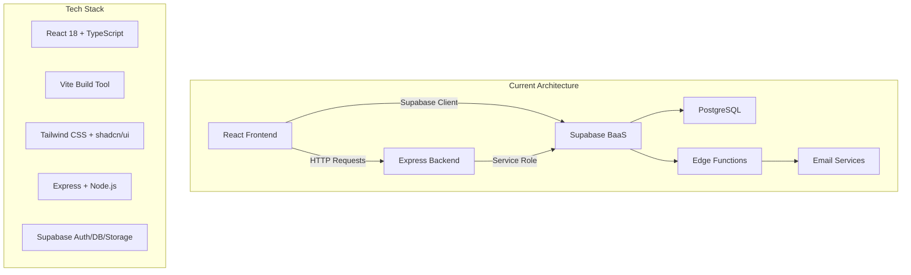
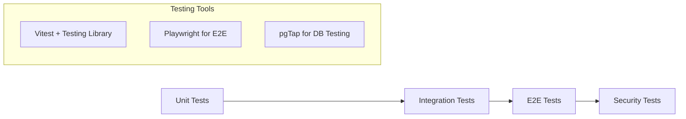
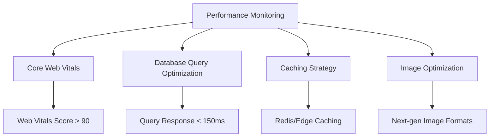
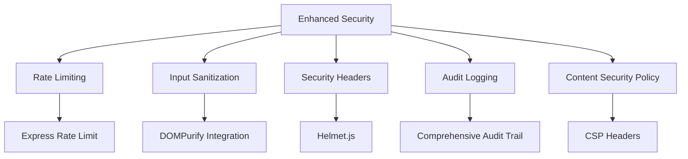
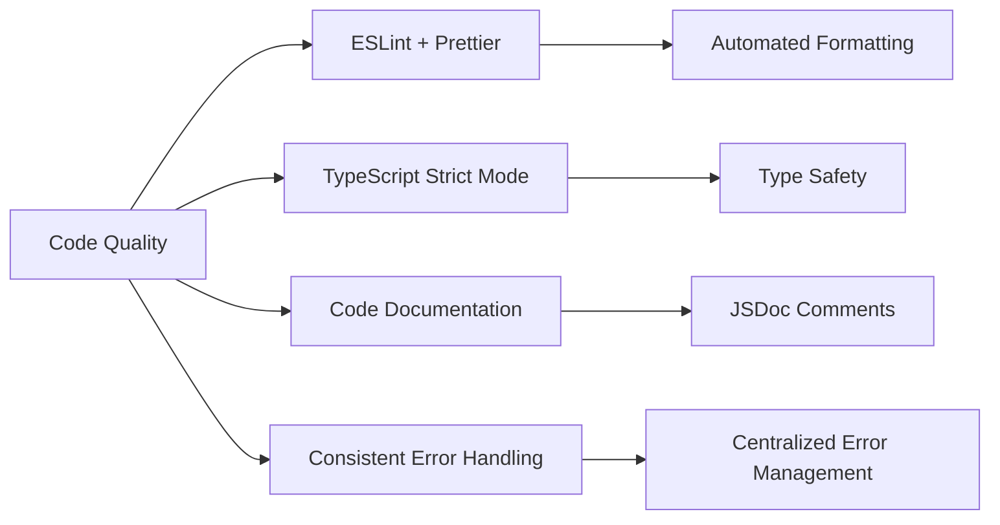
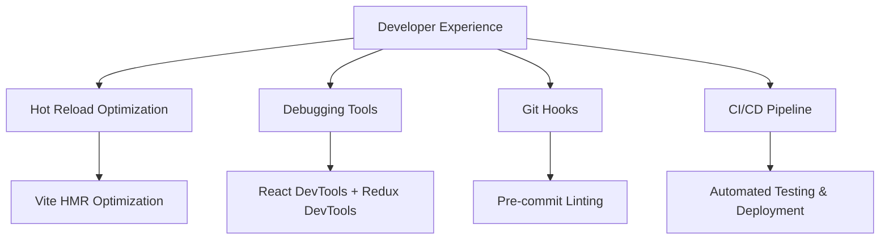
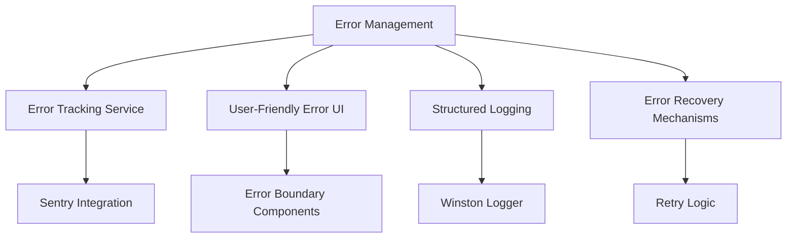
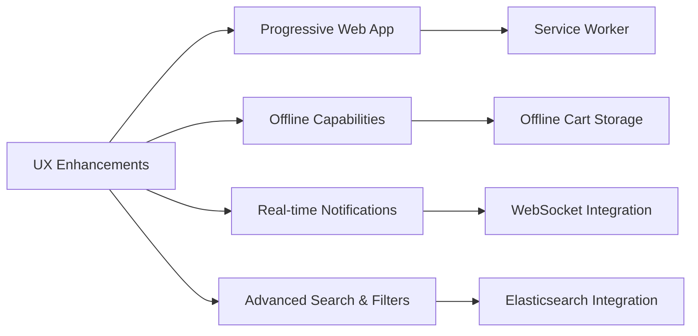
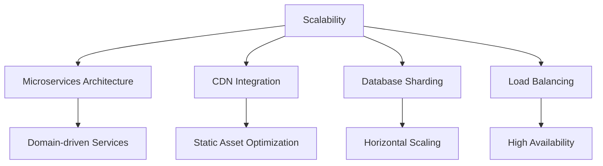

# PROYECTO-SENA: Project Improvement Analysis

## Overview

This document provides a comprehensive analysis of improvement opportunities for the PROYECTO-SENA marketplace platform, based on current architecture, technology stack, and implementation patterns. The analysis covers critical areas including testing infrastructure, performance optimization, security enhancements, code quality, and technical debt reduction.

## Current Architecture Assessment

### Technology Stack Analysis

**Strengths:**
- Modern React 18 with TypeScript for type safety
- Supabase provides unified backend services
- Row Level Security (RLS) for data protection
- Component-based architecture with reusable UI elements

**Areas for Improvement:**
- Limited testing infrastructure
- No performance monitoring
- Minimal error tracking
- Missing development tools optimization

## Critical Improvement Areas

### 1. Testing Infrastructure (Priority: HIGH)

**Current State:**
- Test strategy document exists but implementation is minimal
- No unit tests implemented
- No integration tests
- No E2E testing setup

**Recommended Improvements:**

**Implementation Plan:**
- **Phase 1**: Setup Vitest for frontend unit tests
- **Phase 2**: Implement React Testing Library for component tests
- **Phase 3**: Add Playwright for E2E testing
- **Phase 4**: Database RLS policy testing

**Test Coverage Goals:**
- Frontend components: 80% coverage
- Backend API endpoints: 90% coverage
- Critical user flows: 100% E2E coverage

### 2. Performance Optimization (Priority: HIGH)

**Current Performance Issues:**
- No performance monitoring
- Potential N+1 queries in product listings
- Unoptimized image loading
- No caching strategy

**Optimization Strategy:**

**Implementation Tasks:**
- Add Web Vitals monitoring
- Implement query optimization with Supabase indexes
- Add image optimization with proper sizing and lazy loading
- Implement caching for static data (categories, products)

### 3. Security Enhancements (Priority: MEDIUM)

**Current Security Measures:**
- Row Level Security (RLS) policies implemented
- JWT-based authentication
- Input validation with Zod
- CORS configuration

**Security Improvements:**

**Security Action Items:**
- Implement comprehensive rate limiting
- Add Content Security Policy headers
- Enhance input sanitization for XSS prevention
- Expand audit logging coverage
- Add security testing to CI/CD pipeline

### 4. Code Quality & Technical Debt (Priority: MEDIUM)

**Current Code Quality Issues:**
- Inconsistent error handling patterns
- Missing TypeScript strict mode
- No code formatting standards enforced
- Limited code documentation

**Code Quality Improvements:**

**Implementation Steps:**
- Setup ESLint with TypeScript rules
- Configure Prettier for consistent formatting
- Enable TypeScript strict mode
- Implement centralized error handling
- Add comprehensive JSDoc documentation

### 5. Development Experience (Priority: MEDIUM)

**Current DevEx Limitations:**
- No hot module replacement optimization
- Limited debugging tools
- No pre-commit hooks
- Manual deployment processes

**DevEx Enhancements:**

## Architectural Improvements

### 1. State Management Enhancement

**Current State:**
- React Context for auth and cart
- No global state management
- Prop drilling in some components

**Proposed Solution:**
- Implement Zustand for lightweight state management
- Centralize data fetching with React Query
- Optimize component re-renders

### 2. Error Handling & Monitoring

**Current Limitations:**
- Basic error logging
- No error tracking service
- Limited user error feedback

**Improvement Plan:**

### 3. Database Optimization

**Current Database Issues:**
- No query performance monitoring
- Limited indexing strategy
- Potential data duplication

**Database Improvements:**
- Add database query monitoring
- Implement proper indexing for frequently queried fields
- Optimize RLS policies for performance
- Add database connection pooling

## Feature Enhancement Opportunities

### 1. User Experience Improvements

### 2. Business Logic Enhancements

- **Inventory Management**: Real-time stock updates
- **Order Tracking**: Enhanced order status workflow
- **Analytics Dashboard**: Business intelligence features
- **Multi-language Support**: Internationalization
- **Payment Integration**: Multiple payment methods

### 3. Scalability Improvements

## Implementation Roadmap

### Phase 1: Foundation (Weeks 1-4)
- [ ] Setup comprehensive testing infrastructure
- [ ] Implement code quality tools (ESLint, Prettier)
- [ ] Add performance monitoring
- [ ] Enhance error handling

### Phase 2: Optimization (Weeks 5-8)
- [ ] Database query optimization
- [ ] Implement caching strategy
- [ ] Add security enhancements
- [ ] Improve development workflow

### Phase 3: Enhancement (Weeks 9-12)
- [ ] State management optimization
- [ ] Advanced features implementation
- [ ] Performance tuning
- [ ] Documentation completion

### Phase 4: Scaling (Weeks 13-16)
- [ ] Architecture refinements
- [ ] Scalability improvements
- [ ] Production optimization
- [ ] Monitoring and alerting

## Success Metrics

### Technical Metrics
- **Test Coverage**: > 80% for critical paths
- **Performance**: Core Web Vitals score > 90
- **Security**: Zero critical vulnerabilities
- **Code Quality**: ESLint score > 95%

### Business Metrics
- **Page Load Time**: < 2 seconds
- **Error Rate**: < 0.1%
- **User Satisfaction**: > 4.5/5
- **Development Velocity**: 20% improvement

## Risk Assessment

### High Risk Areas
- **Data Migration**: Database schema changes
- **Authentication Changes**: User session management
- **Payment Processing**: Financial transaction security

### Mitigation Strategies
- Comprehensive testing before production deployment
- Feature flags for gradual rollout
- Database backup and rollback procedures
- Staged deployment approach

## Resource Requirements

### Development Team
- **Frontend Developer**: React/TypeScript expertise
- **Backend Developer**: Node.js/Express experience
- **DevOps Engineer**: CI/CD and infrastructure
- **QA Engineer**: Testing and quality assurance

### Tools and Services
- **Testing**: Vitest, Playwright, Testing Library
- **Monitoring**: Web Vitals, error tracking service
- **Security**: Security scanning tools
- **Performance**: Database monitoring tools

## Conclusion

The PROYECTO-SENA platform has a solid foundation with modern technology choices and secure architecture. The primary improvement opportunities lie in testing infrastructure, performance optimization, and development experience enhancement. By implementing the recommended improvements in a phased approach, the platform can achieve better reliability, performance, and maintainability while supporting future growth and feature development.

The proposed improvements will transform the platform from a functional MVP to a production-ready, scalable marketplace solution that can handle increased user load and business requirements effectively.